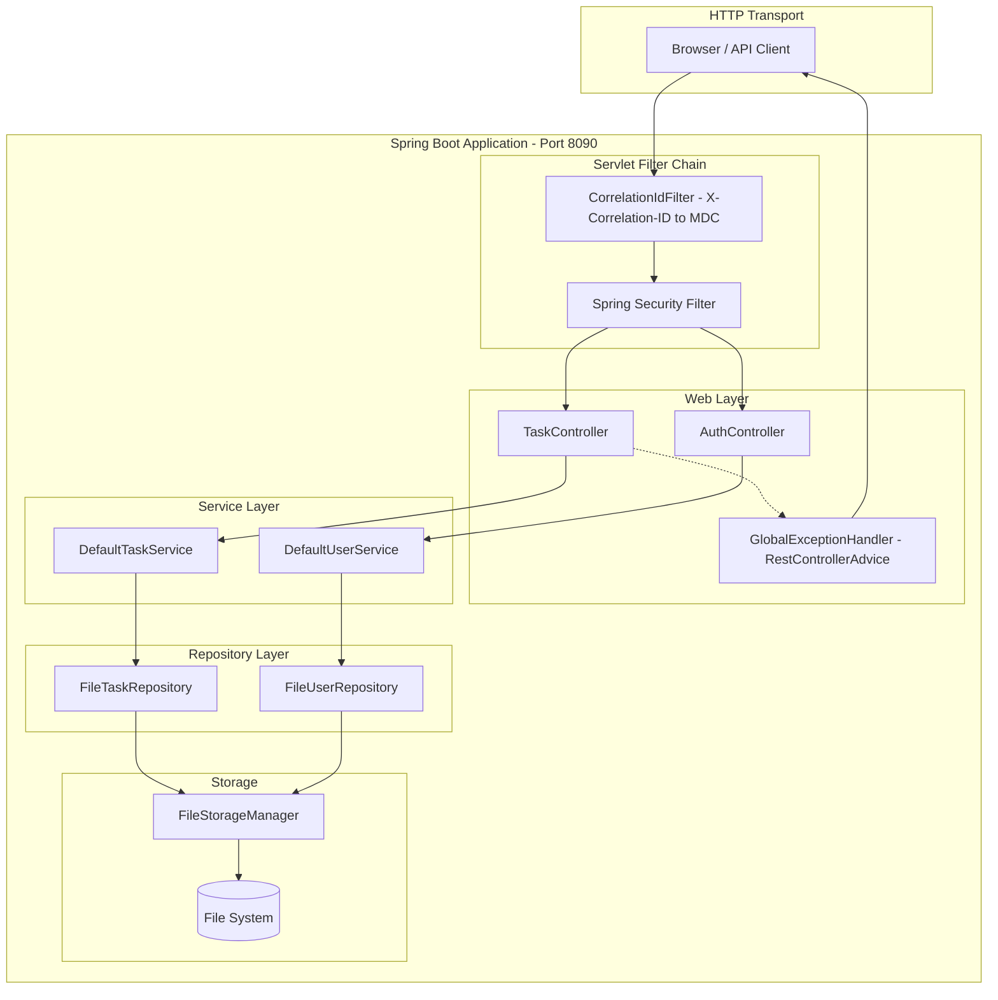

# Deployment / Layered Architecture Diagram

```mermaid
graph TB
    subgraph "HTTP Transport"
        CLI[Browser / API Client]
    end

    subgraph "Spring Boot Application - Port 8090"
        subgraph "Servlet Filter Chain"
            CIF[CorrelationIdFilter - X-Correlation-ID to MDC]
            SSF[Spring Security Filter]
        end
        subgraph "Web Layer"
            GEH[GlobalExceptionHandler - RestControllerAdvice]
            TC[TaskController]
            AC[AuthController]
        end
        subgraph "Service Layer"
            DTS[DefaultTaskService]
            DUS[DefaultUserService]
        end
        subgraph "Repository Layer"
            FTR[FileTaskRepository]
            FUR[FileUserRepository]
        end
        subgraph "Storage"
            FSM[FileStorageManager]
            FS[(File System)]
        end
    end

    CLI --> CIF
    CIF --> SSF
    SSF --> TC
    SSF --> AC
    TC -.-> GEH
    GEH --> CLI
    TC --> DTS
    AC --> DUS
    DTS --> FTR
    DUS --> FUR
    FTR --> FSM
    FUR --> FSM
    FSM --> FS
```
