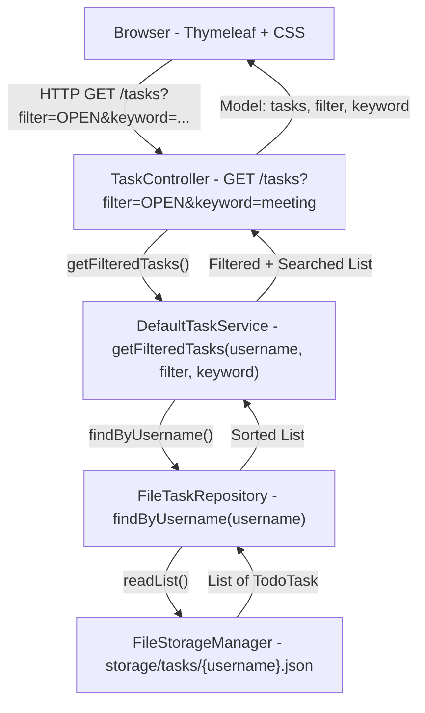
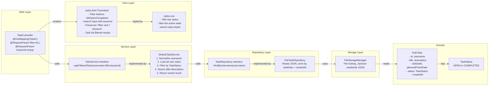
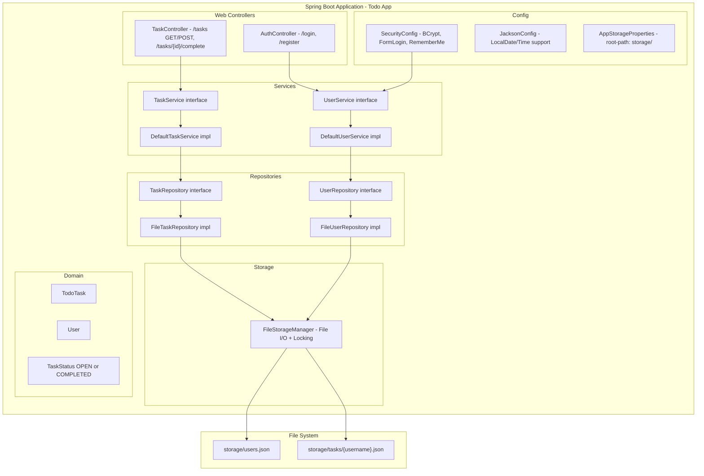
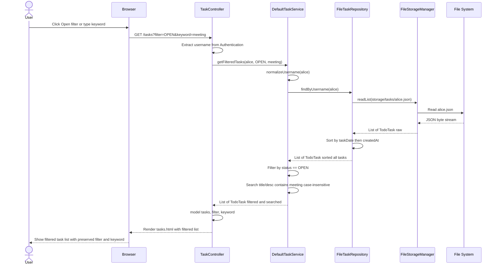
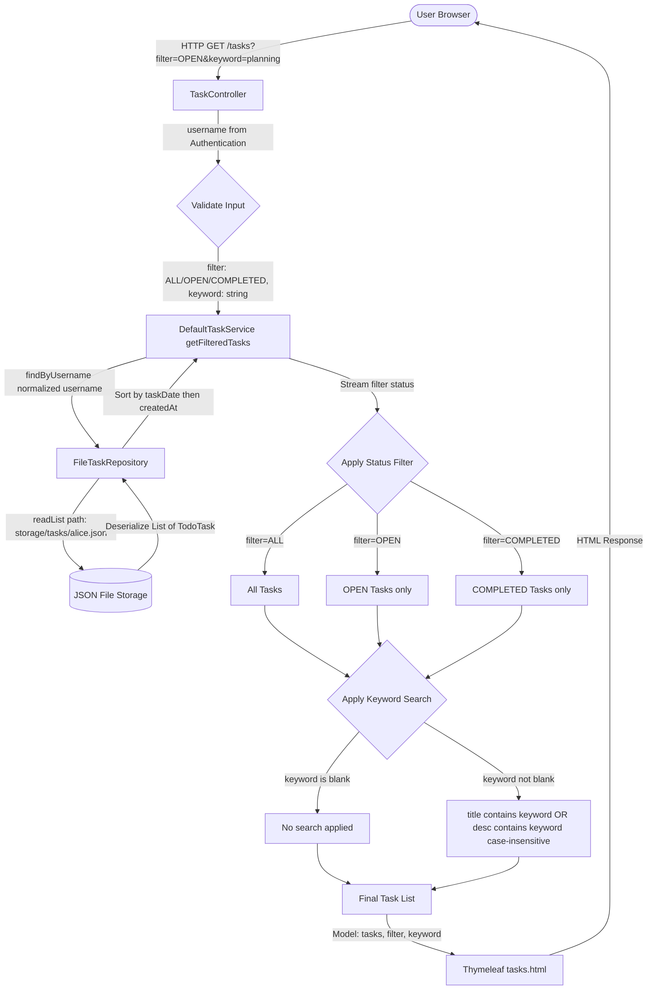
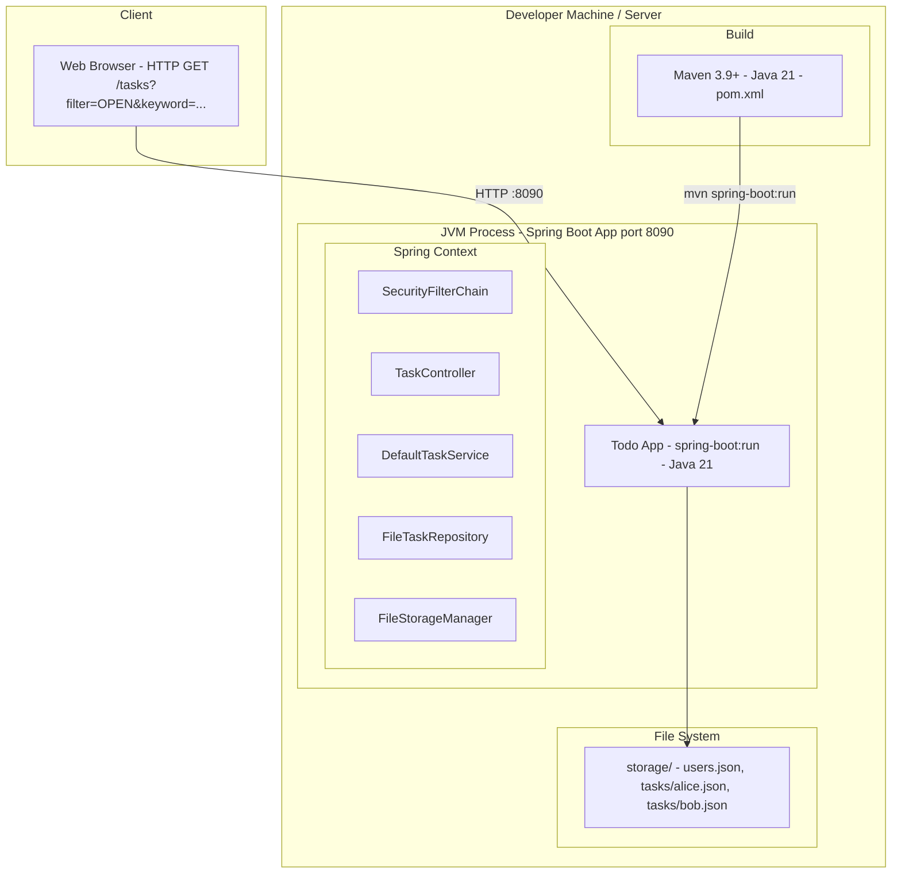

# Solution Architecture Diagrams
## JIRA: EPMCDMETST-52763 -- Todo Dashboard: Task List Filters & Keyword Search

---

## 1. High Level Design

### Overview
The feature adds **status-based filtering** (All/Open/Completed) and **keyword search** to the Todo Dashboard.
The architecture follows the existing layered MVC pattern: query parameters flow from the browser through
the Controller -> Service -> (filtered in-memory after Repository load) -> Thymeleaf view.
No new persistence layer changes are required; filtering is performed in-memory on the sorted task list.

---

## 2. Low Level Design

### Detailed Component Interactions

---

## 3. Component Diagram

---

## 4. Sequence Diagram -- Filtered Task Search

---

## 5. Data Flow Diagram

---

## 6. Deployment Diagram

