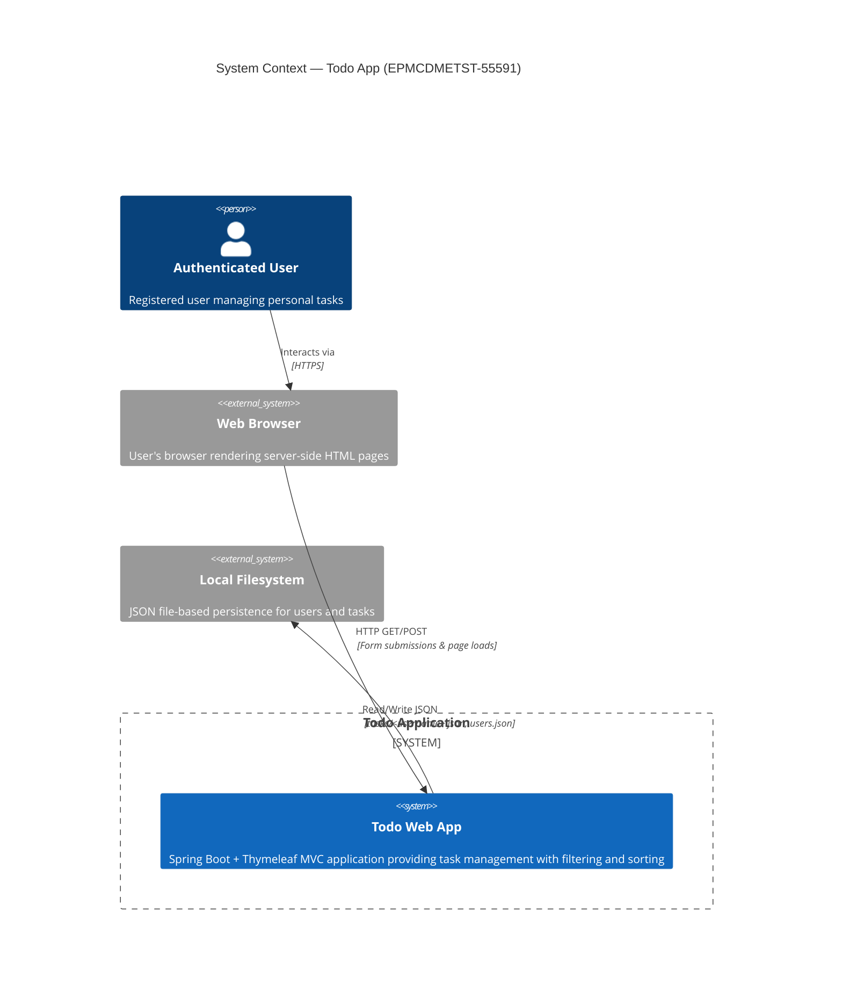
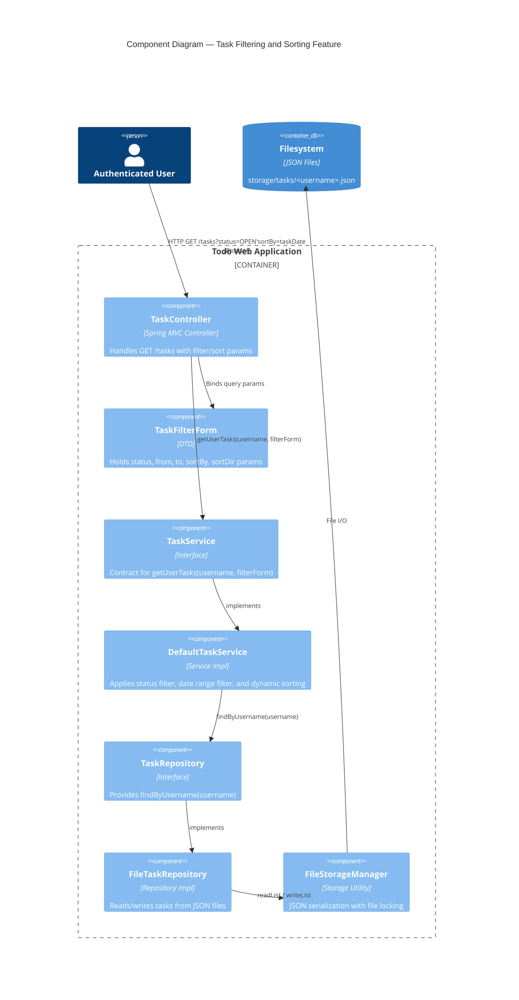
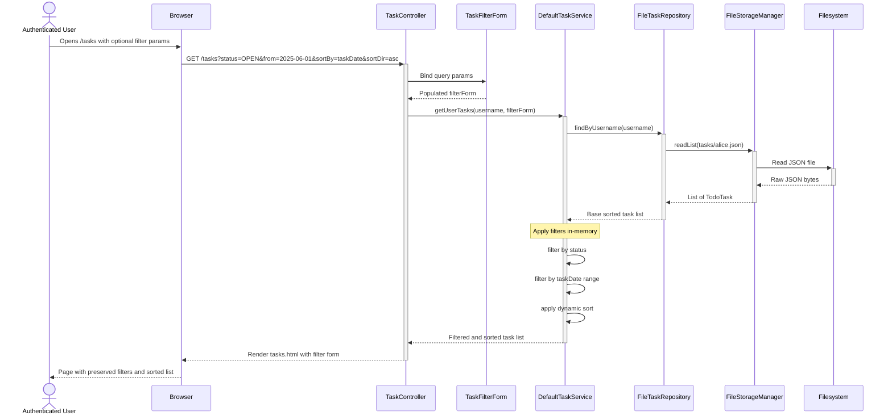
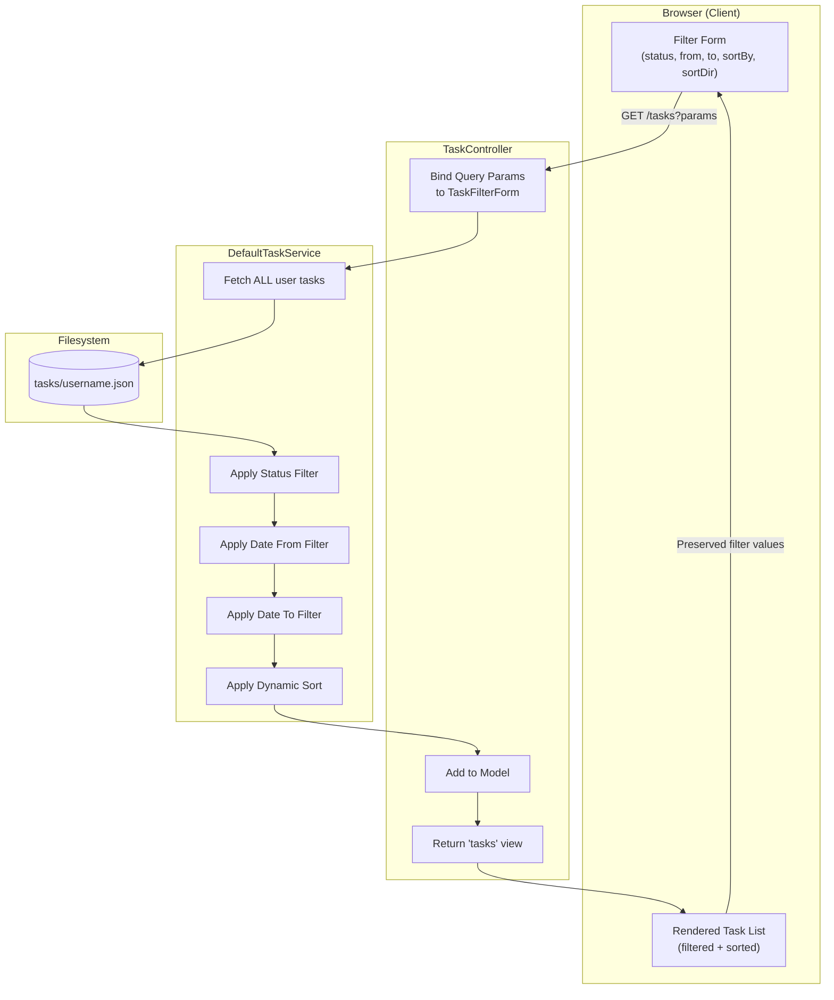
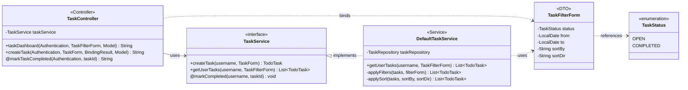
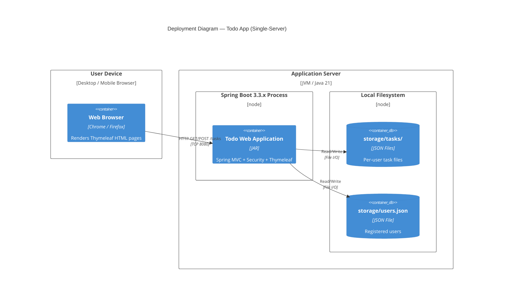

# Solution Diagrams — EPMCDMETST-55591
## Todo Dashboard: Add Task Filtering (Status/Date) and Sorting

---

## 1. Architecture Diagram (C4 Context)

---

## 2. Component Diagram

---

## 3. Sequence Diagram — Filter and Sort Flow

---

## 4. Data Flow Diagram

---

## 5. Class Diagram

---

## 6. Deployment Diagram

