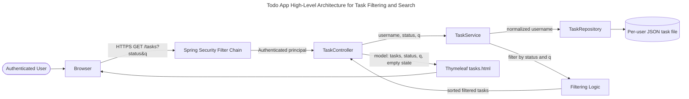
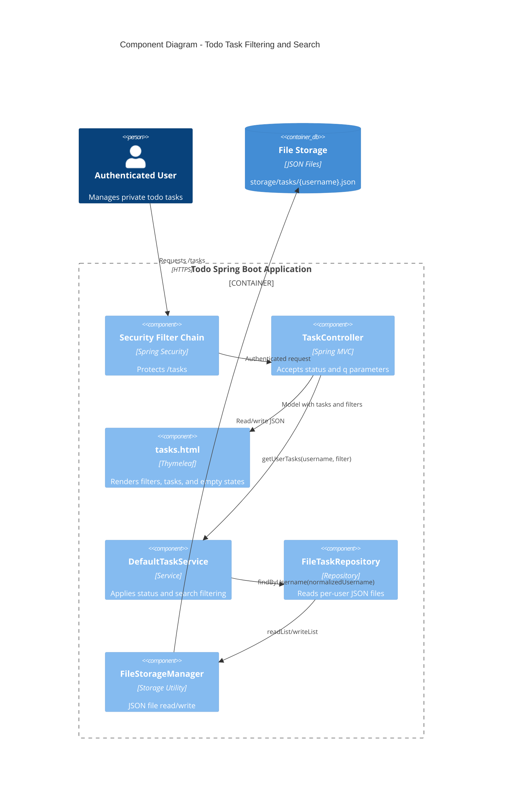
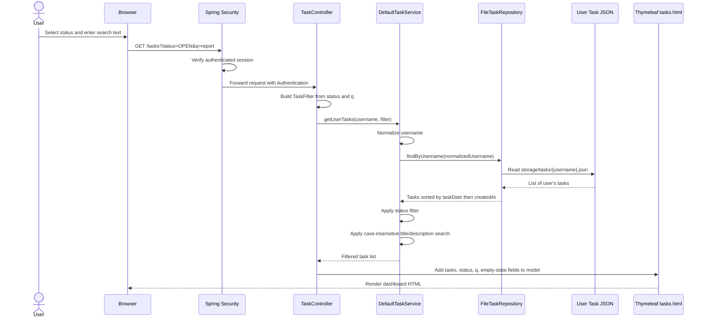
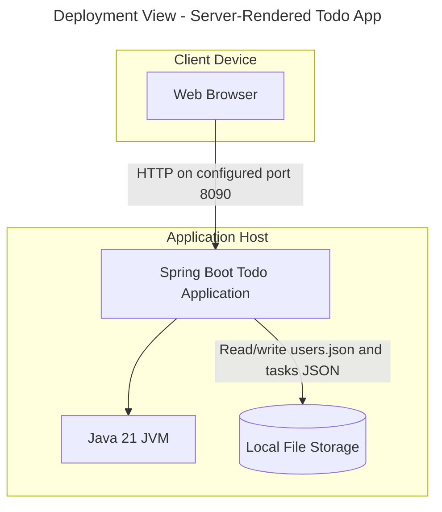
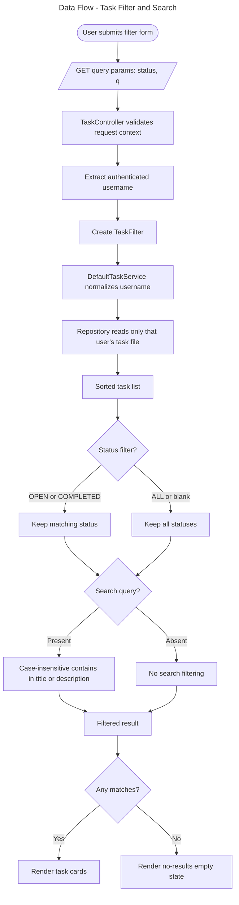
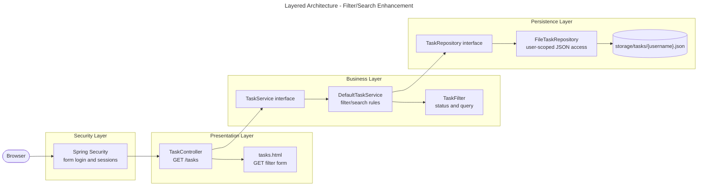
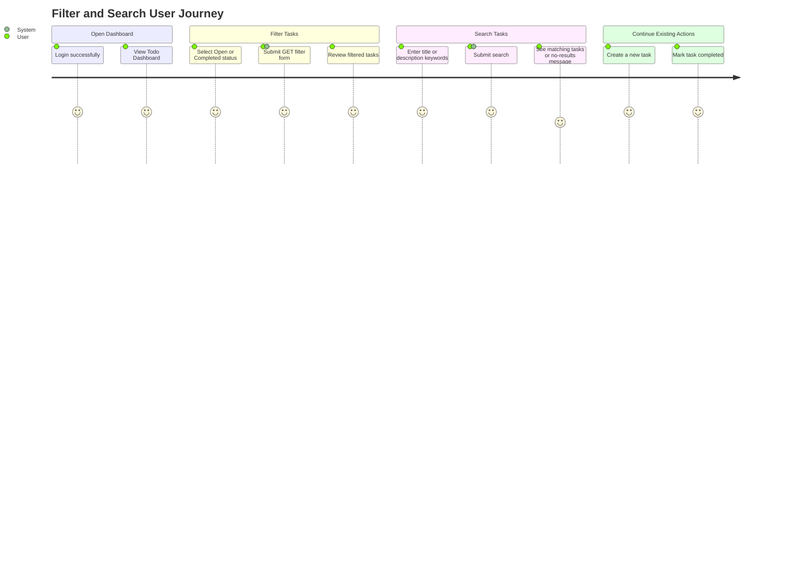
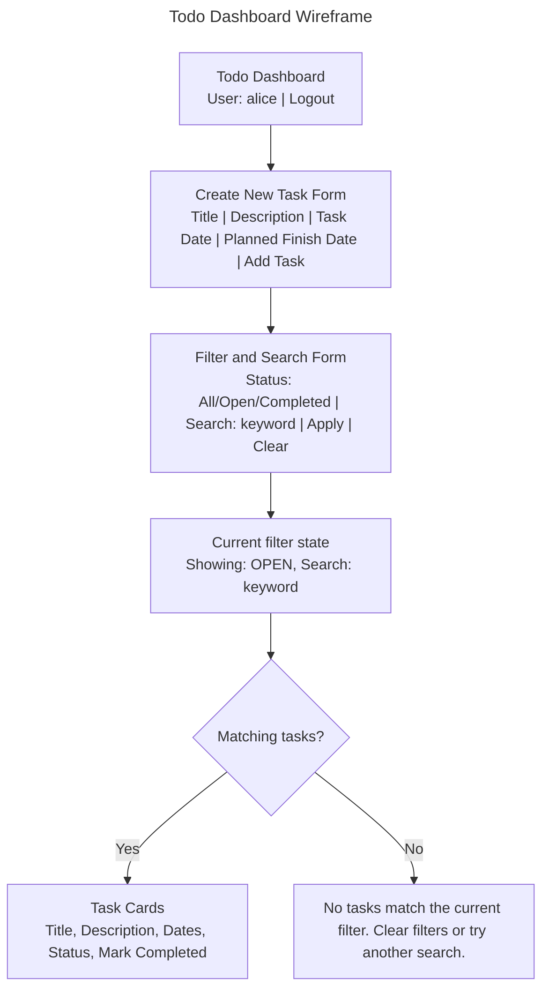

# EPMCDMETST-55854 Solution Diagrams

## Architecture Summary

Design for adding task list filtering and case-insensitive title/description search to the server-rendered Todo Dashboard while preserving layered architecture, Spring Security authentication, user isolation, and existing task sort order.

## High-Level Design

## Low-Level Design

```mermaid
---
title: Low-Level Component Design for Filtered Task Dashboard
config:
  theme: default
---
classDiagram
  direction LR
  class TaskController {
    <<controller>>
    +taskDashboard(Authentication, String status, String q, Model) String
    +createTask(Authentication, TaskForm, BindingResult, Model) String
    +markTaskCompleted(Authentication, String taskId) String
  }
  class TaskService {
    <<interface>>
    +createTask(String username, TaskForm taskForm) TodoTask
    +getUserTasks(String username) List~TodoTask~
    +getUserTasks(String username, TaskFilter filter) List~TodoTask~
    +markCompleted(String username, String taskId) void
  }
  class DefaultTaskService {
    <<service>>
    -TaskRepository taskRepository
    +getUserTasks(String username, TaskFilter filter) List~TodoTask~
    -matchesStatus(TodoTask task, TaskFilter filter) boolean
    -matchesQuery(TodoTask task, TaskFilter filter) boolean
  }
  class TaskFilter {
    <<dto>>
    +TaskStatus status
    +String query
    +boolean hasStatusFilter()
    +boolean hasQuery()
  }
  class TaskRepository {
    <<interface>>
    +findByUsername(String username) List~TodoTask~
    +save(TodoTask task) TodoTask
    +findById(String username, String taskId) Optional~TodoTask~
    +update(TodoTask task) void
  }
  class FileTaskRepository {
    <<repository>>
    +findByUsername(String username) List~TodoTask~
  }
  class TodoTask {
    +String id
    +String username
    +String title
    +String description
    +LocalDate taskDate
    +LocalDate plannedFinishDate
    +TaskStatus status
    +LocalDateTime createdAt
  }
  class TaskStatus {
    <<enumeration>>
    OPEN
    COMPLETED
  }
  TaskController --> TaskService : delegates
  TaskService <|.. DefaultTaskService : implements
  DefaultTaskService --> TaskRepository : reads user tasks
  TaskRepository <|.. FileTaskRepository : implements
  DefaultTaskService --> TaskFilter : applies
  FileTaskRepository --> TodoTask : returns sorted list
  TodoTask --> TaskStatus : has
```

## Component Diagram

## Sequence Diagram

## Deployment Diagram

## Data Flow Diagram

## Architecture Diagram

## Wireframes and User Flow

## Alternatives Considered

| Alternative | Pros | Cons | Decision |
|---|---|---|---|
| Service-layer filtering after `findByUsername` | Minimal change, preserves repository contract and sorting, easy to test | Reads all user tasks before filtering | Recommended |
| Repository-level filtering | Better for larger datasets and future DB migration | Adds complexity to current file-backed app | Defer |
| Client-side filtering | Fast UI interactions | Conflicts with server-rendered requirement and may expose unnecessary data | Rejected |

## Security, Observability, Scalability, Rollout

- Security: derive username from `Authentication`; never from request parameters.
- User isolation: use normalized authenticated username for repository access.
- Validation: normalize blank query to no search and support known statuses safely.
- Observability: existing logs are sufficient for this change; add debug logs only if needed.
- Scalability: current in-memory filtering is acceptable; future DB repositories can push filters into indexed queries.
- Rollout: implement optional parameters on existing `/tasks`, add tests, verify no-filter behavior.
