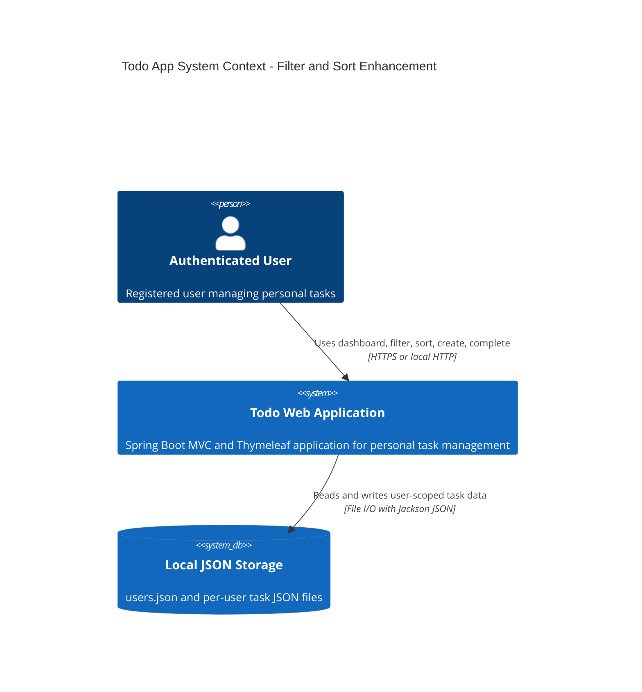
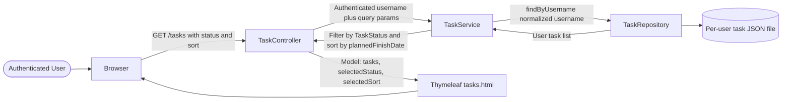
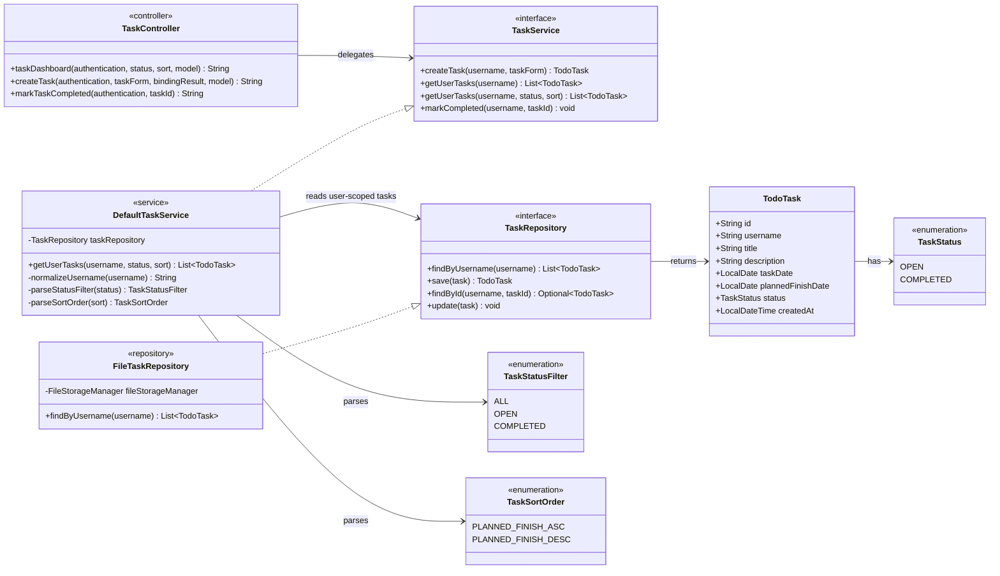
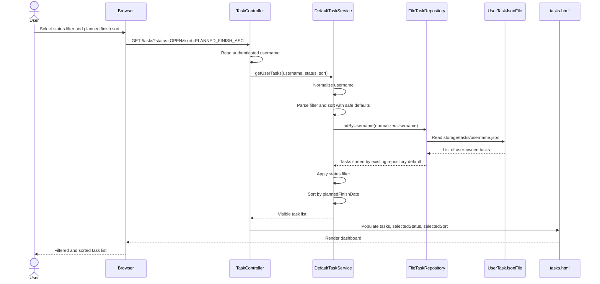
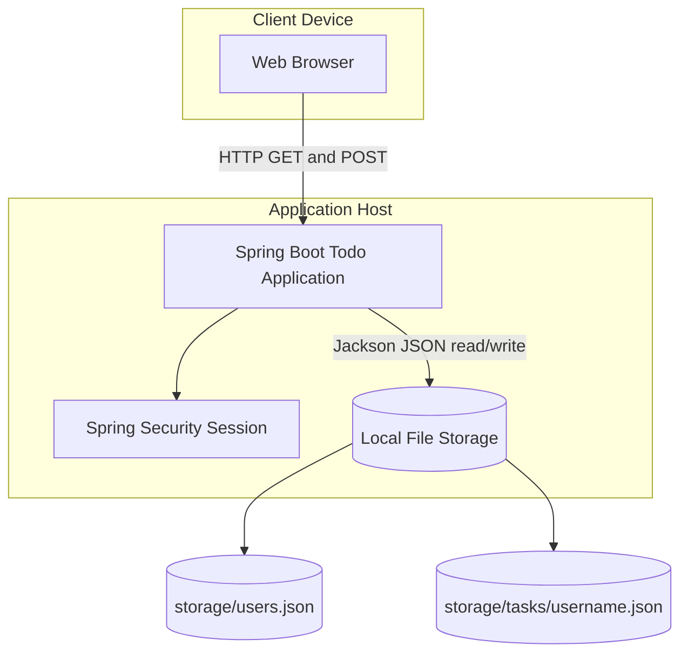
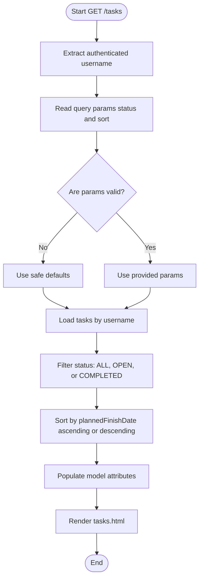
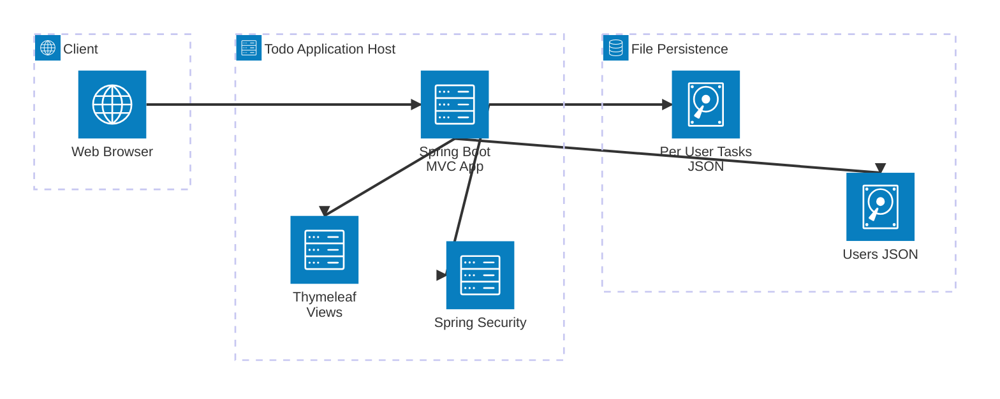
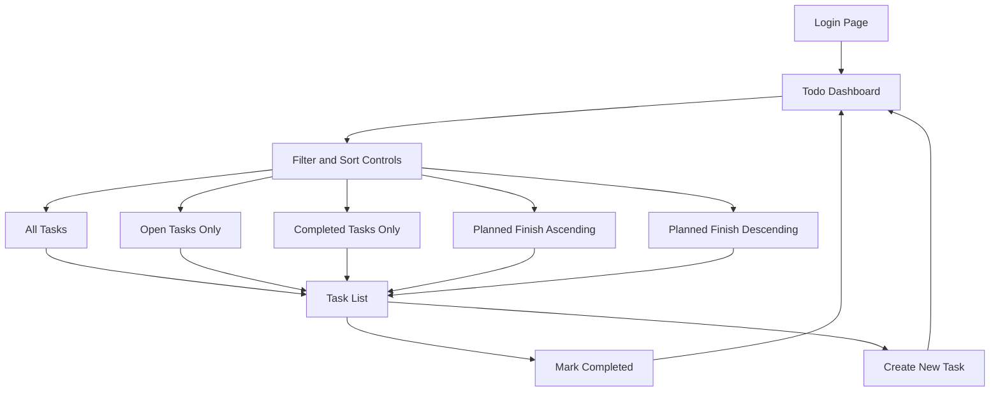
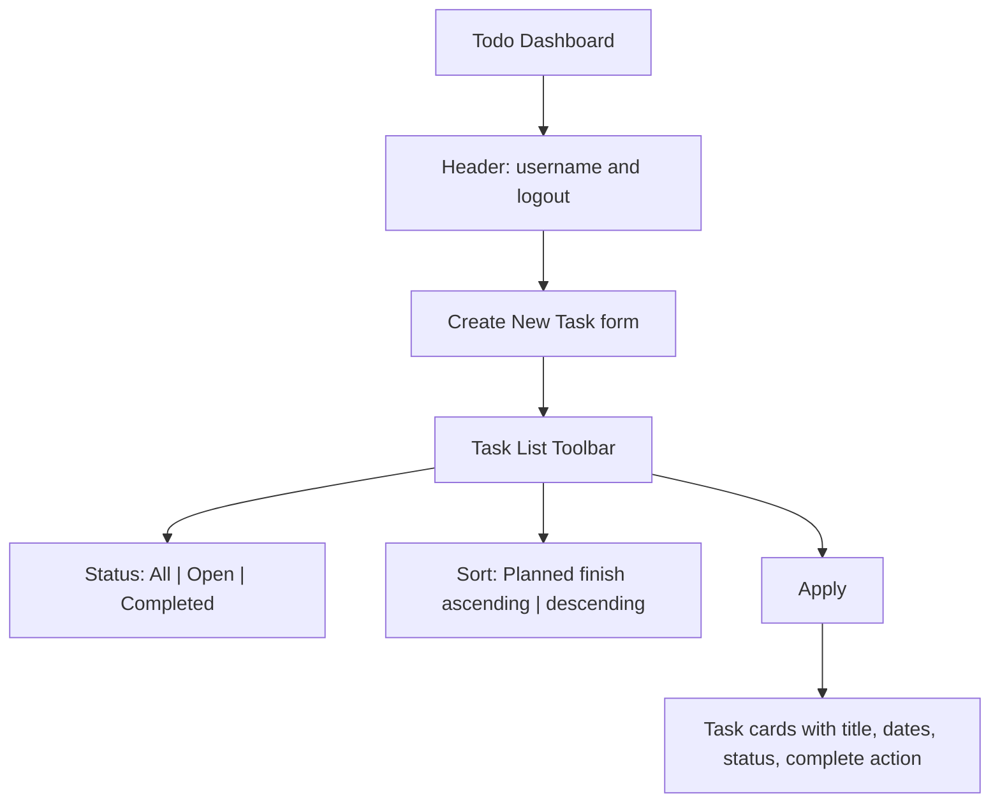

# Design Diagrams - EPMCDMETST-55858

## High Level Design

The feature is implemented inside the existing Spring Boot modular monolith. Browser requests remain server-rendered through Thymeleaf. Authenticated users access `/tasks` with optional query parameters for task status filtering and planned finish date sorting. The controller delegates to the service layer, which enforces user scoping, validates parameters, filters the user task list, sorts the visible tasks, and returns the result to the view.

## Low Level Design

### Component Diagram

### Sequence Diagram

### Deployment Diagram

### Data Flow Diagram

### Architecture Diagram

## API and View Contract

| Endpoint | Method | Parameters | Behavior |
|---|---|---|---|
| `/tasks` | GET | `status`, `sort` | Returns authenticated user's filtered and sorted tasks. |
| `/tasks` | POST | `TaskForm` | Creates a task and redirects to `/tasks`. Existing behavior remains unchanged. |
| `/tasks/{taskId}/complete` | POST | `taskId` path variable | Marks authenticated user's task as completed. Existing behavior remains unchanged. |

## Error Handling and Edge Cases

- Unknown `status` values are treated as `ALL`.
- Unknown `sort` values are treated as the selected safe default.
- Empty parameter values are treated as defaults.
- No matching tasks renders the existing empty-state message.
- Only tasks loaded via the authenticated username are filtered and sorted.
- Sorting should be null-safe even though planned finish date is currently required by `TaskForm`.

## Wireframes and User Flow

## Alternatives Considered

| Alternative | Pros | Cons | Decision |
|---|---|---|---|
| Service-layer filtering/sorting | Minimal change, preserves repository abstraction, easy to test | Loads all user tasks before filtering | Recommended for current file-based app. |
| Repository-level query methods | Efficient if storage becomes database-backed | Over-specializes file repository and expands interface now | Defer until persistence changes. |
| Client-side filtering/sorting | Fast UI after load | Exposes all current user's tasks to page and duplicates logic | Not preferred for server-rendered flow. |

## Rollout Plan

1. Add query enums or parser helpers for status filter and sort order.
2. Extend service method and implement filtering/sorting.
3. Update controller GET `/tasks` to accept optional params and populate model attributes.
4. Update `tasks.html` and CSS for filter/sort controls.
5. Add service and controller tests.
6. Run `mvn test` and regression-test registration, login, create, complete, filter, and sort flows.
