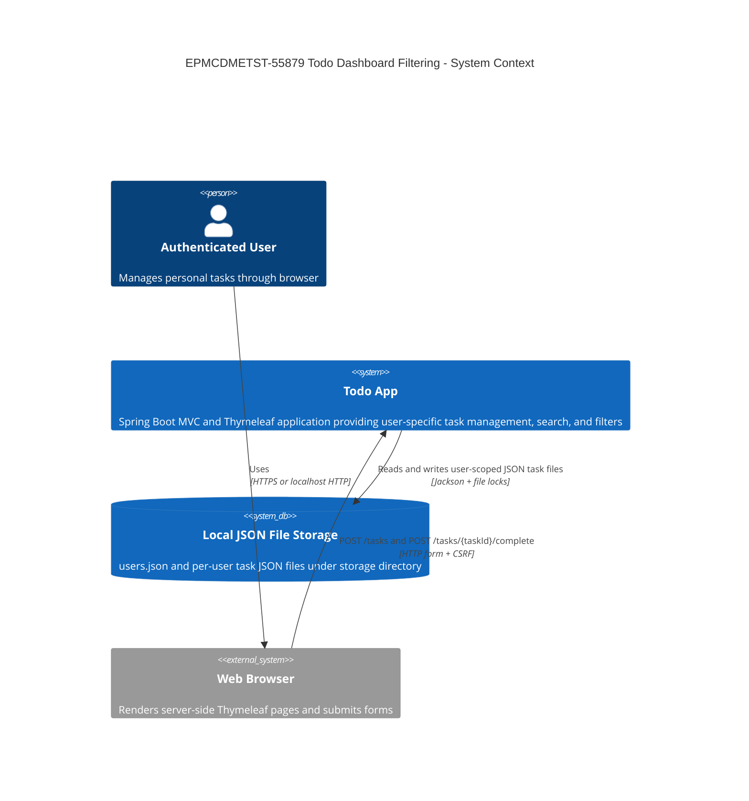
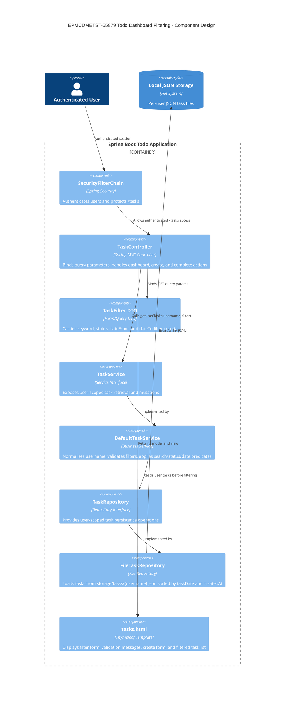
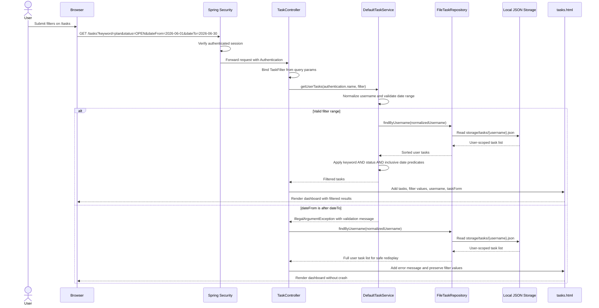
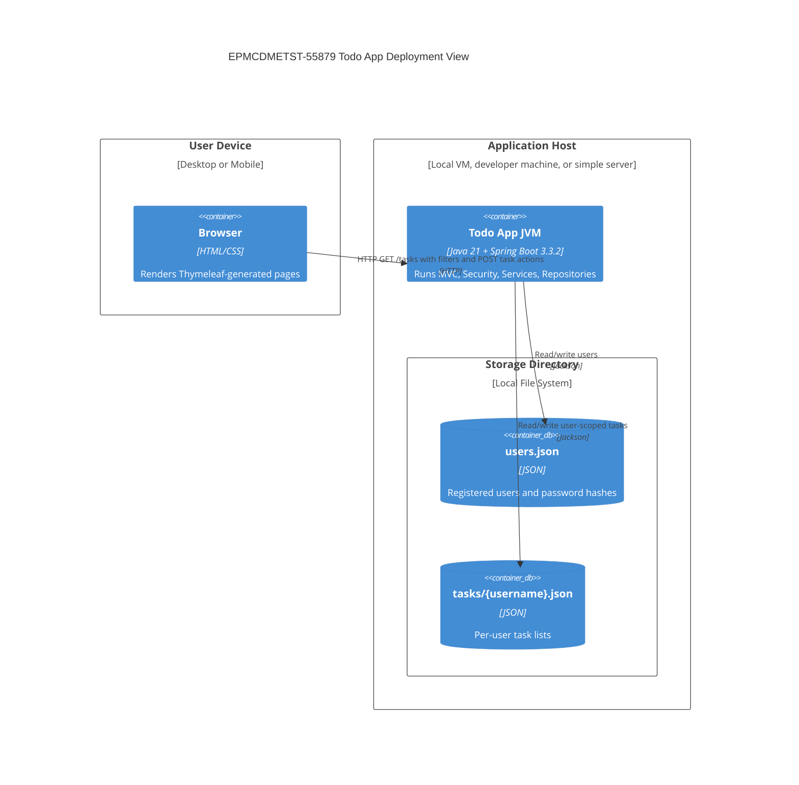
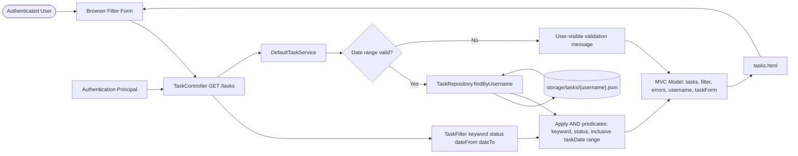
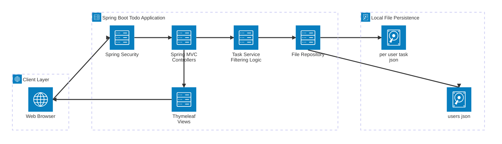
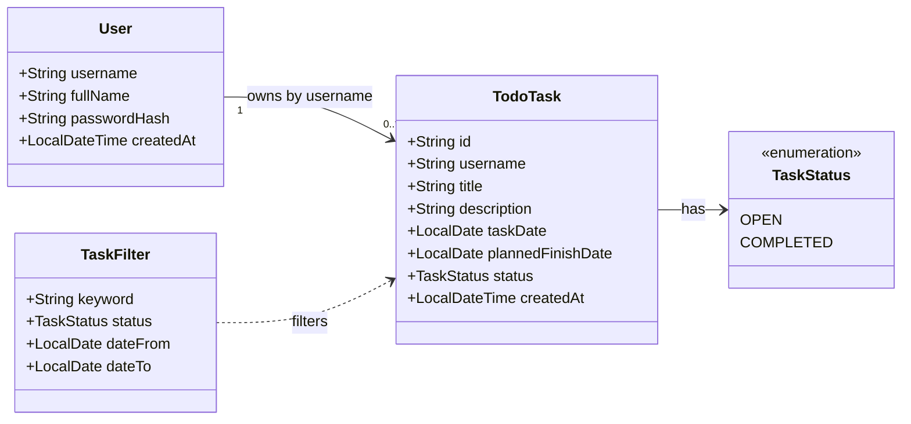
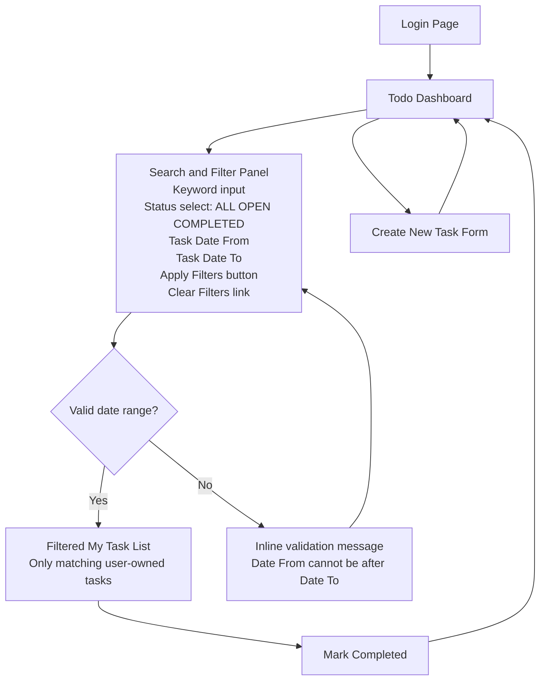
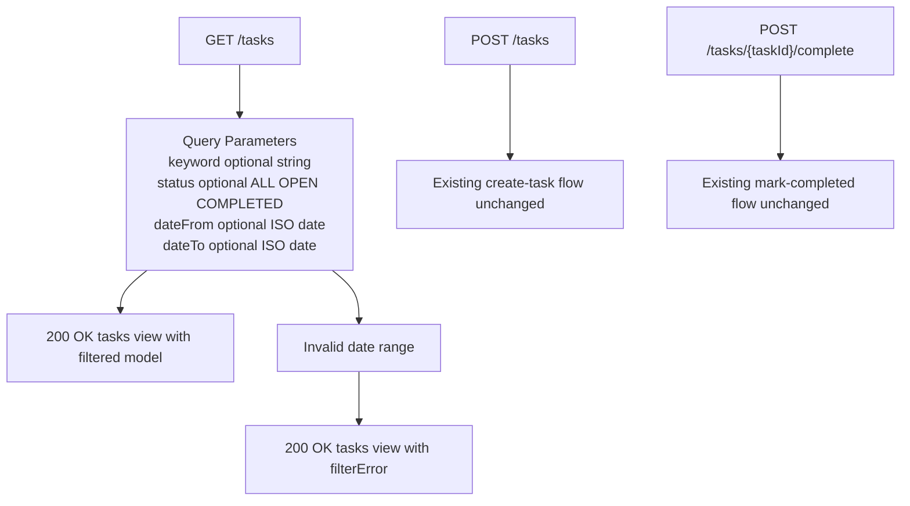
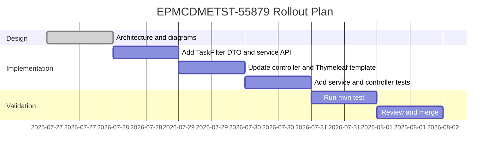

# EPMCDMETST-55879 - Solution Diagrams

## High Level Design - System Context and Architecture

## Low Level Design - Component Diagram

## Sequence Diagram - Filtered Dashboard Request

## Deployment Diagram

## Data Flow Diagram

## Architecture Diagram

## Domain Model Diagram

## Wireframe and User Flow

## API and Contract Design

## Rollout Plan

## Mermaid Validation Notes

All diagrams use Mermaid-supported diagram types: C4Context, C4Component, sequenceDiagram, C4Deployment, flowchart, architecture-beta, classDiagram, and gantt. Node labels containing special characters are quoted where needed. C4 diagrams include titles. Flowcharts avoid reserved lowercase `end` labels.
