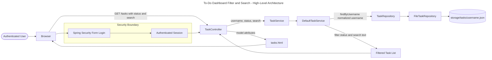
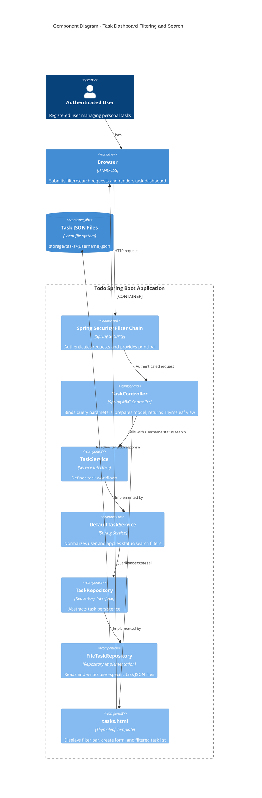
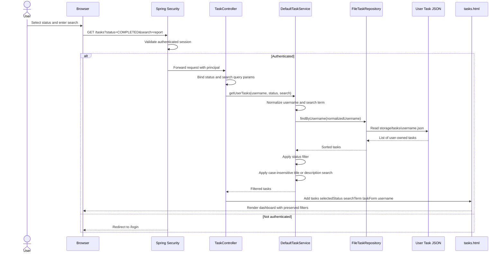
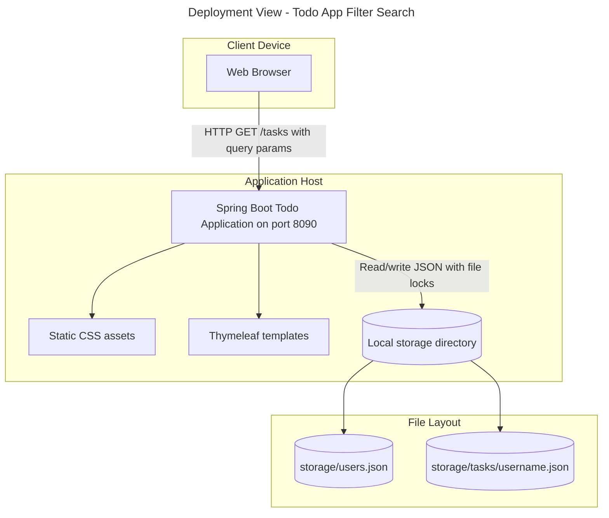
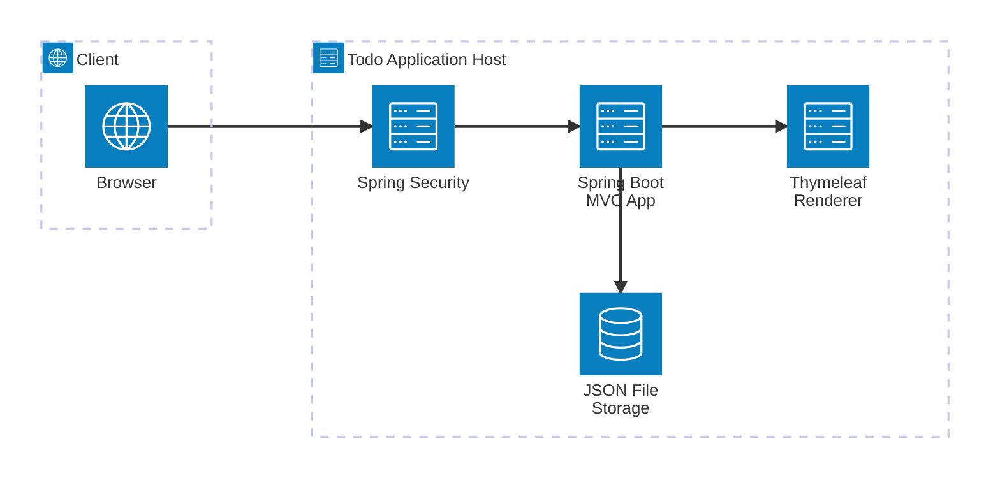
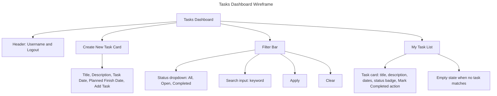
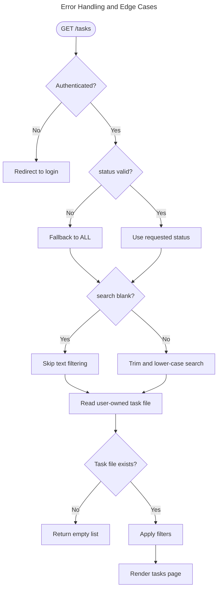

# EPMCDMETST-55956 Solution Diagrams

## High-Level Design

## Low-Level Design

```mermaid
---
title: Low-Level Components for Task Dashboard Filtering
config:
  theme: default
---
classDiagram
  direction LR

  class TaskController {
    -TaskService taskService
    +rootRedirect() String
    +taskDashboard(Authentication, Model, String, String) String
    +createTask(Authentication, TaskForm, BindingResult, Model) String
    +markTaskCompleted(Authentication, String) String
  }

  class TaskService {
    <<interface>>
    +createTask(String, TaskForm) TodoTask
    +getUserTasks(String) List
    +getUserTasks(String, String, String) List
    +markCompleted(String, String) void
  }

  class DefaultTaskService {
    -TaskRepository taskRepository
    +createTask(String, TaskForm) TodoTask
    +getUserTasks(String) List
    +getUserTasks(String, String, String) List
    +markCompleted(String, String) void
    -normalizeUsername(String) String
    -matchesStatus(TodoTask, String) boolean
    -matchesSearch(TodoTask, String) boolean
  }

  class TaskRepository {
    <<interface>>
    +findByUsername(String) List
    +save(TodoTask) TodoTask
    +findById(String, String) Optional
    +update(TodoTask) void
  }

  class FileTaskRepository {
    -FileStorageManager fileStorageManager
    -Path storageRootPath
    +findByUsername(String) List
    +save(TodoTask) TodoTask
    +findById(String, String) Optional
    +update(TodoTask) void
  }

  class TodoTask {
    +String id
    +String username
    +String title
    +String description
    +LocalDate taskDate
    +LocalDate plannedFinishDate
    +TaskStatus status
    +LocalDateTime createdAt
  }

  class TaskStatus {
    <<enumeration>>
    OPEN
    COMPLETED
  }

  TaskController --> TaskService : delegates
  TaskService <|.. DefaultTaskService : implements
  DefaultTaskService --> TaskRepository : reads user tasks
  TaskRepository <|.. FileTaskRepository : implements
  FileTaskRepository --> TodoTask : persists
  TodoTask --> TaskStatus : has status
```

## Component Diagram

## Sequence Diagram

## Deployment Diagram

## Data Flow Diagram

```mermaid
---
title: Data Flow - Status Filter and Search
config:
  theme: default
---
flowchart LR
  QP[/Query Params: status and search/] --> Controller[TaskController]
  Auth[/Authentication Principal/] --> Controller
  Controller --> Params[Validated Dashboard Criteria]
  Params --> Service[DefaultTaskService]
  Service --> Normalize[Normalize username and trim search]
  Normalize --> Repo[TaskRepository.findByUsername]
  Repo --> UserFile[(User Task File)]
  UserFile --> AllTasks[All tasks for authenticated user]
  AllTasks --> StatusDecision{Status is ALL?}
  StatusDecision -->|Yes| SearchFilter[Search filter]
  StatusDecision -->|No| StatusFilter[Keep tasks with matching status]
  StatusFilter --> SearchFilter
  SearchFilter --> SearchDecision{Search is blank?}
  SearchDecision -->|Yes| Result[Filtered task list]
  SearchDecision -->|No| TextMatch[Case-insensitive title or description substring match]
  TextMatch --> Result
  Result --> Model[Model attributes]
  Model --> View[tasks.html]
```

## Architecture Diagram

## Wireframe and User Flow

## Error Handling and Edge Cases

