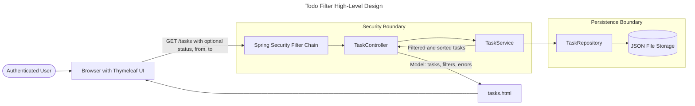
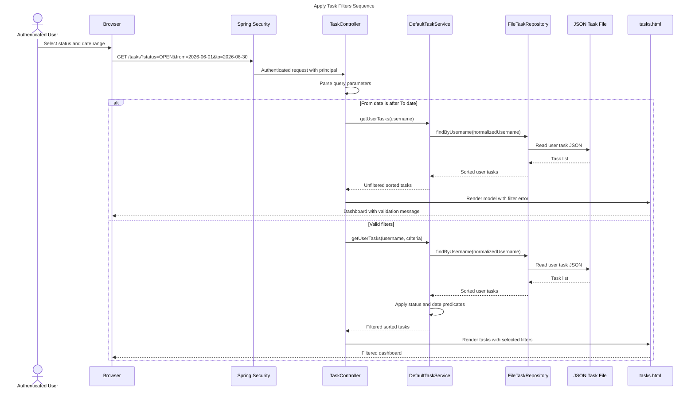
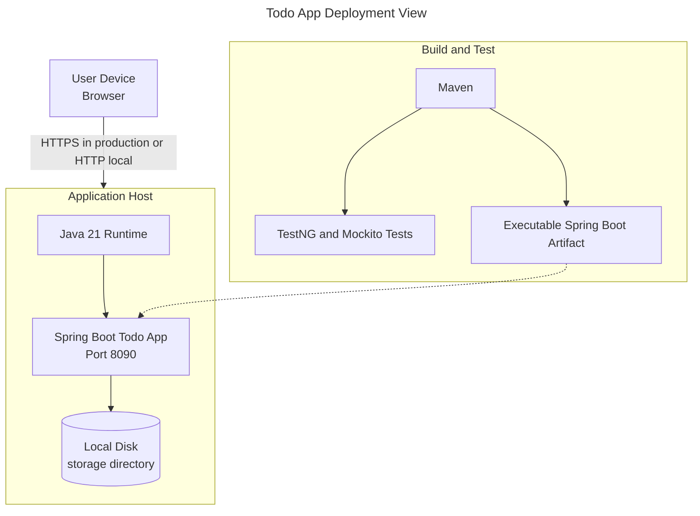
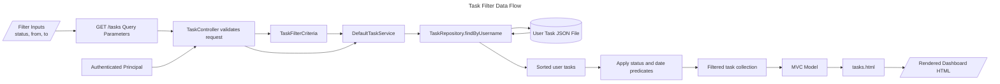
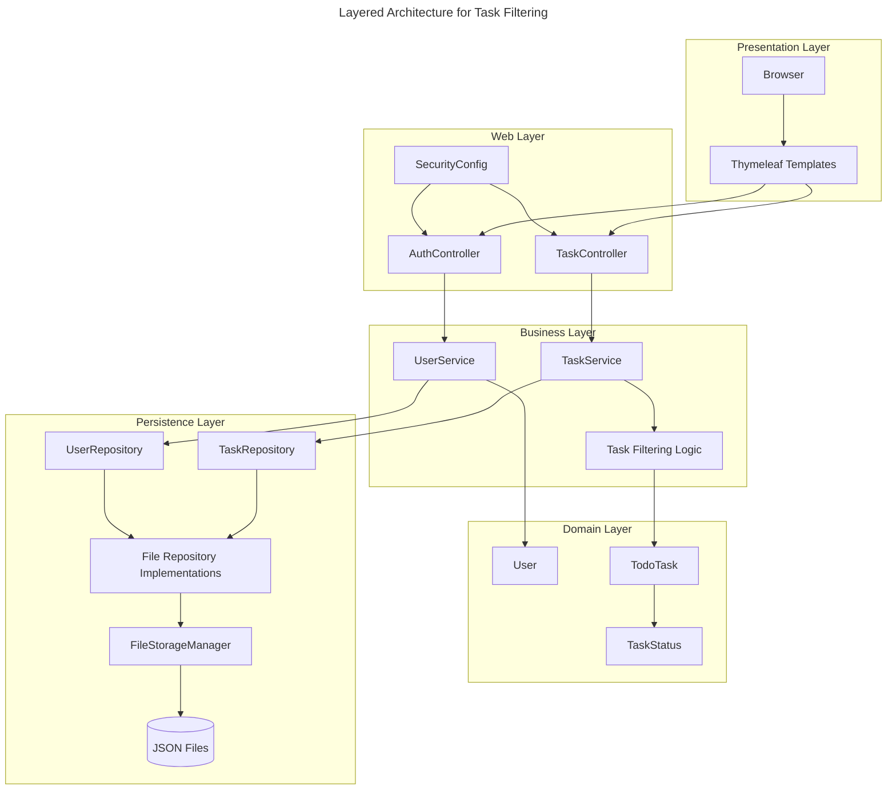
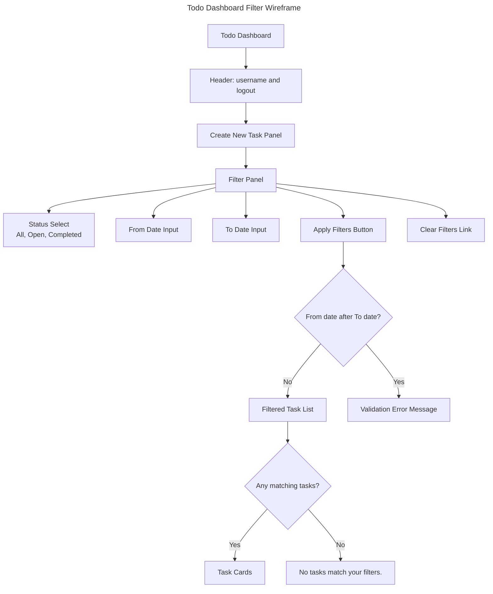
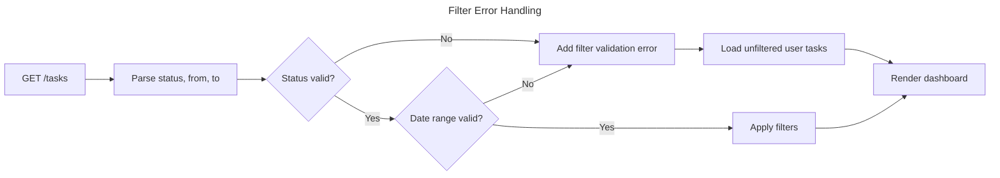

# Solution Diagrams - EPMCDMETST-55996

## High-Level Design



## Low-Level Component Diagram

```mermaid
---
title: Todo Filter Component Design
config:
  theme: default
---
flowchart TB
  subgraph WebLayer["Web Layer"]
    TaskController["TaskController\nGET /tasks"]
    TasksTemplate["tasks.html\nFilter form and task list"]
  end

  subgraph DtoLayer["DTO and Criteria Layer"]
    TaskFilterCriteria["TaskFilterCriteria\nstatus, from, to"]
    TaskForm["TaskForm\ncreate task input"]
  end

  subgraph ServiceLayer["Service Layer"]
    TaskService["TaskService interface"]
    DefaultTaskService["DefaultTaskService\nfilter, create, complete"]
  end

  subgraph DomainLayer["Domain Layer"]
    TodoTask["TodoTask"]
    TaskStatus["TaskStatus\nOPEN, COMPLETED"]
  end

  subgraph RepositoryLayer["Repository Layer"]
    TaskRepository["TaskRepository interface"]
    FileTaskRepository["FileTaskRepository\nread sorted user tasks"]
    FileStorageManager["FileStorageManager\nJSON read and write"]
    TaskFiles[("storage/tasks/<username>.json")]
  end

  TaskController --> TaskFilterCriteria
  TaskController --> TaskService
  TaskController --> TasksTemplate
  TaskService <|-.-> DefaultTaskService
  DefaultTaskService --> TaskRepository
  DefaultTaskService --> TodoTask
  DefaultTaskService --> TaskStatus
  TaskRepository <|-.-> FileTaskRepository
  FileTaskRepository --> FileStorageManager
  FileStorageManager --> TaskFiles
  TasksTemplate --> TaskFilterCriteria
  TaskForm --> TaskController
```

## Sequence Diagram



## Deployment Diagram



## Data Flow Diagram



## Architecture Diagram



## Wireframe and User Flow



## Error Handling Flow


