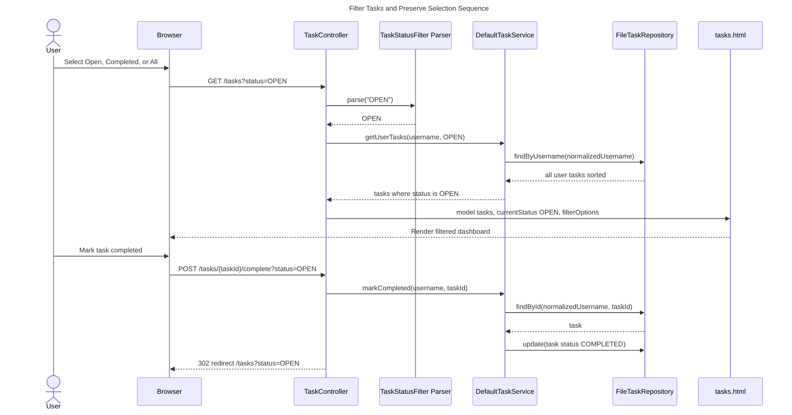
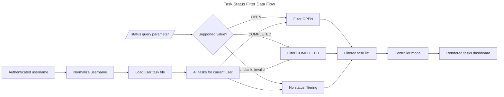
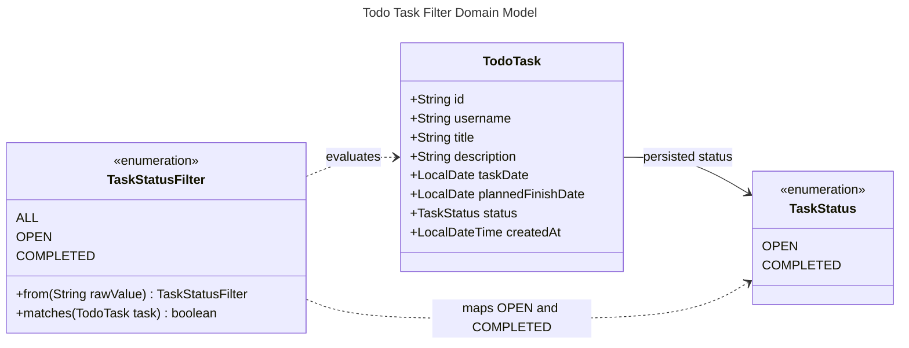
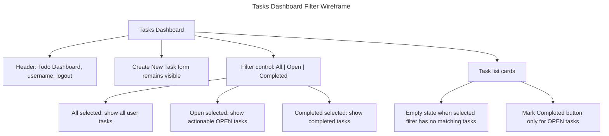

# EPMCDMETST-56035 Solution Diagrams

## High-Level Design

The solution extends the existing Spring Boot MVC todo application with a task status filter on the authenticated user's dashboard. The filter is expressed as a query parameter on `/tasks`, is rendered by Thymeleaf, and is applied through the existing controller-service-repository boundary.

### Architecture Diagram

```mermaid
---
title: Todo Status Filter Architecture
config:
  theme: default
---
flowchart LR
  User([Authenticated User]) --> Browser[Browser]
  Browser -->|GET /tasks?status=OPEN| TaskController[TaskController]
  Browser -->|POST /tasks with status| TaskController
  Browser -->|POST /tasks/{taskId}/complete with status| TaskController

  subgraph SpringBoot[Spring Boot Todo App]
    direction TB
    TaskController --> FilterParser[Status Filter Parser]
    TaskController --> TaskService[TaskService]
    TaskService --> DefaultTaskService[DefaultTaskService]
    DefaultTaskService --> TaskRepository[TaskRepository]
    TaskRepository --> FileTaskRepository[FileTaskRepository]
    FileTaskRepository --> Storage[(JSON Task Files)]
    TaskController --> Thymeleaf[Thymeleaf tasks.html]
  end

  Thymeleaf --> Browser

  classDef user fill:#e0f2fe,stroke:#0369a1,color:#0f172a
  classDef app fill:#eef2ff,stroke:#4338ca,color:#0f172a
  classDef data fill:#dcfce7,stroke:#15803d,color:#0f172a
  class User,Browser user
  class TaskController,FilterParser,TaskService,DefaultTaskService,TaskRepository,FileTaskRepository,Thymeleaf app
  class Storage data
```

## Low-Level Design

### Component Diagram

```mermaid
---
title: Task Status Filter Component Design
config:
  theme: default
---
flowchart TB
  subgraph WebLayer[Web Layer]
    TC[TaskController]
    TM[tasks.html Thymeleaf Template]
    SF[TaskStatusFilter Parser]
  end

  subgraph ServiceLayer[Service Layer]
    TSI[TaskService Interface]
    DSS[DefaultTaskService]
  end

  subgraph DomainLayer[Domain Layer]
    TSF[TaskStatusFilter: ALL, OPEN, COMPLETED]
    TS[TaskStatus: OPEN, COMPLETED]
    TT[TodoTask]
    TF[TaskForm]
  end

  subgraph PersistenceLayer[Persistence Layer]
    TRI[TaskRepository Interface]
    FTR[FileTaskRepository]
    JSON[(storage/tasks/{username}.json)]
  end

  TC -->|reads request param status| SF
  SF -->|valid filter or ALL fallback| TC
  TC -->|getUserTasks username filter| TSI
  TC -->|createTask username form| TSI
  TC -->|markCompleted username taskId| TSI
  TC -->|model: tasks currentStatus filterOptions| TM
  TSI --> DSS
  DSS -->|normalizes username| TRI
  DSS -->|filters by status after user lookup| TSF
  DSS --> TT
  TT --> TS
  DSS --> TF
  TRI --> FTR
  FTR --> JSON
```

### Sequence Diagram



### Deployment Diagram

```mermaid
---
title: Deployment View for Todo App Status Filter
config:
  theme: default
---
flowchart TB
  subgraph ClientDevice[Client Device]
    Browser[Web Browser]
  end

  subgraph Host[Application Host]
    JVM[Java 21 Runtime]
    App[Spring Boot Todo App on port 8090]
    Static[Static CSS]
    Templates[Thymeleaf Templates]
    Storage[(Local storage directory)]
  end

  Browser -->|HTTPS or HTTP depending environment| App
  App --> JVM
  App --> Templates
  App --> Static
  App -->|Jackson read/write with file locks| Storage
  Storage --> Users[(users.json)]
  Storage --> Tasks[(tasks/{username}.json)]
```

### Data Flow Diagram



## API and Route Design

| Route | Method | Parameters | Behavior |
|---|---|---|---|
| `/tasks` | GET | `status=OPEN|COMPLETED|ALL` optional | Lists authenticated user's tasks using selected filter; unsupported values fall back to `ALL` |
| `/tasks` | POST | task form fields plus optional `status` | Creates OPEN task and redirects to `/tasks?status={currentStatus}` |
| `/tasks/{taskId}/complete` | POST | optional `status` | Marks authenticated user's task completed and redirects to `/tasks?status={currentStatus}` |

## Data Model



## Wireframe and User Flow



## Error Handling and Edge Cases

- Missing `status` query parameter resolves to `ALL`.
- Unsupported `status` value resolves to `ALL` without throwing an error.
- Blank `status` value resolves to `ALL`.
- Filtering never bypasses authenticated user scoping.
- Existing tasks without unexpected status should continue to render; if a legacy null status is encountered, it should not match `OPEN` or `COMPLETED` and should appear only in `ALL` unless separately remediated.
- Service exceptions during create return the dashboard view with the current filter preserved in the model.

## Rollout Plan

1. Add filter representation and parser.
2. Extend service API and implementation for filtered reads.
3. Update controller routes to accept and preserve `status`.
4. Update Thymeleaf and CSS for filter control and active state.
5. Add/extend service and controller tests for accepted criteria.
6. Run `mvn test` and review regression results.

## Alternatives Considered

| Alternative | Pros | Cons | Decision |
|---|---|---|---|
| Filter in repository | Less memory filtering for future DB implementation | Couples query semantics to file repository; requires repository signature changes | Not preferred for current file persistence |
| Filter in service | Keeps user scoping and business behavior centralized; minimal persistence changes | Loads all user tasks before filtering | Recommended |
| Filter only in Thymeleaf | Minimal backend change | Violates backend-supported filtering requirement and complicates tests | Rejected |
