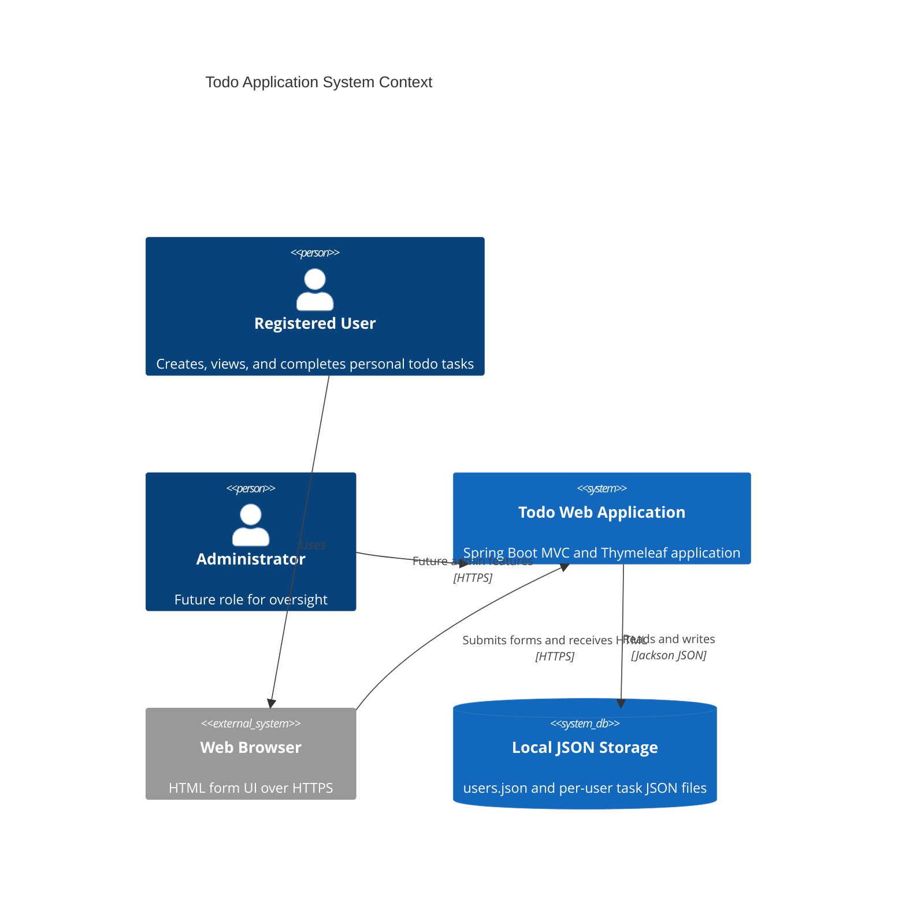
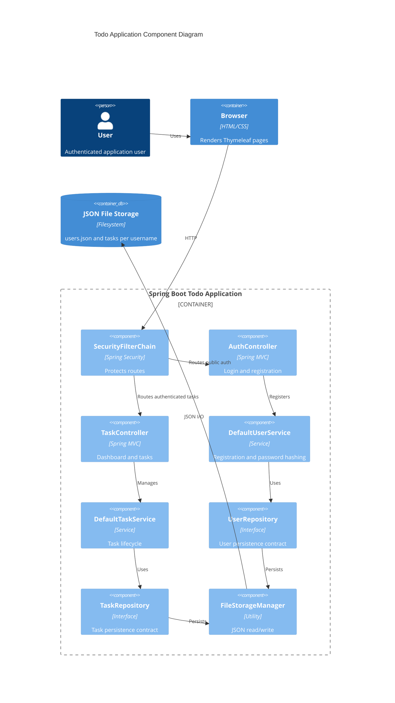
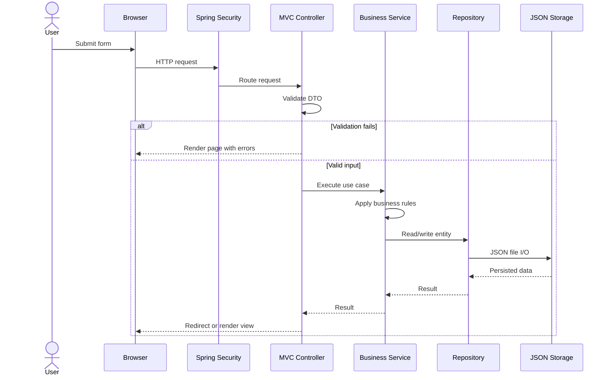
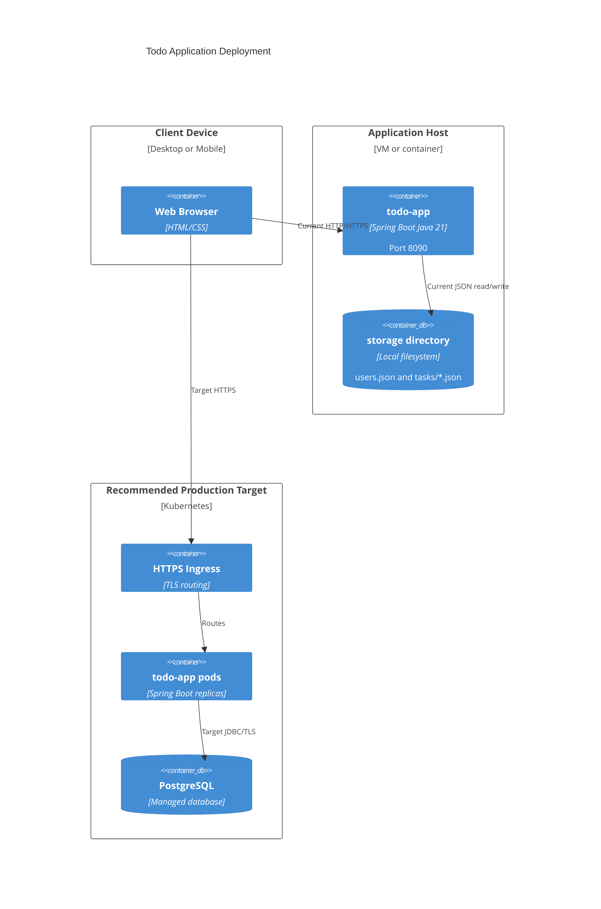
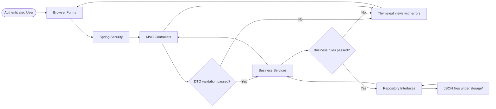
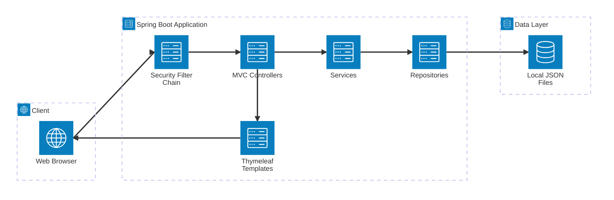
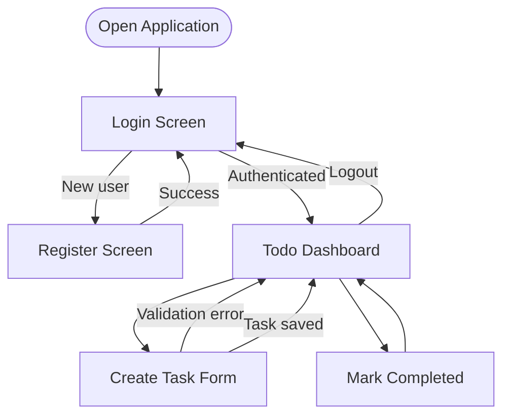

# Solution Diagrams - EPMCDMETST-5623 Todo Application

## High Level Design

The solution uses a layered Spring Boot MVC architecture for user-specific task management. Current persistence is JSON filesystem storage; production evolution should use PostgreSQL, HTTPS ingress, externalized sessions or JWT, and observability.

## Low Level Design

### Component Diagram

### Sequence Diagram

### Deployment Diagram

### Data Flow Diagram

### Architecture Diagram

### Wireframe User Flow

## Alternatives

| Option | Pros | Cons | Recommendation |
|---|---|---|---|
| JSON persistence | Simple and local | Single-node only | Demo only |
| PostgreSQL | Scalable and transactional | Requires DB migration | Production target |
| MVC form login | Simple | Not API-friendly | Keep current UI |
| REST with JWT | Stateless | Larger scope | Use if approved |
