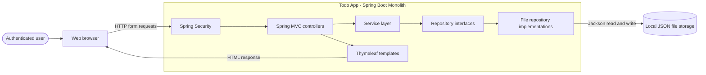
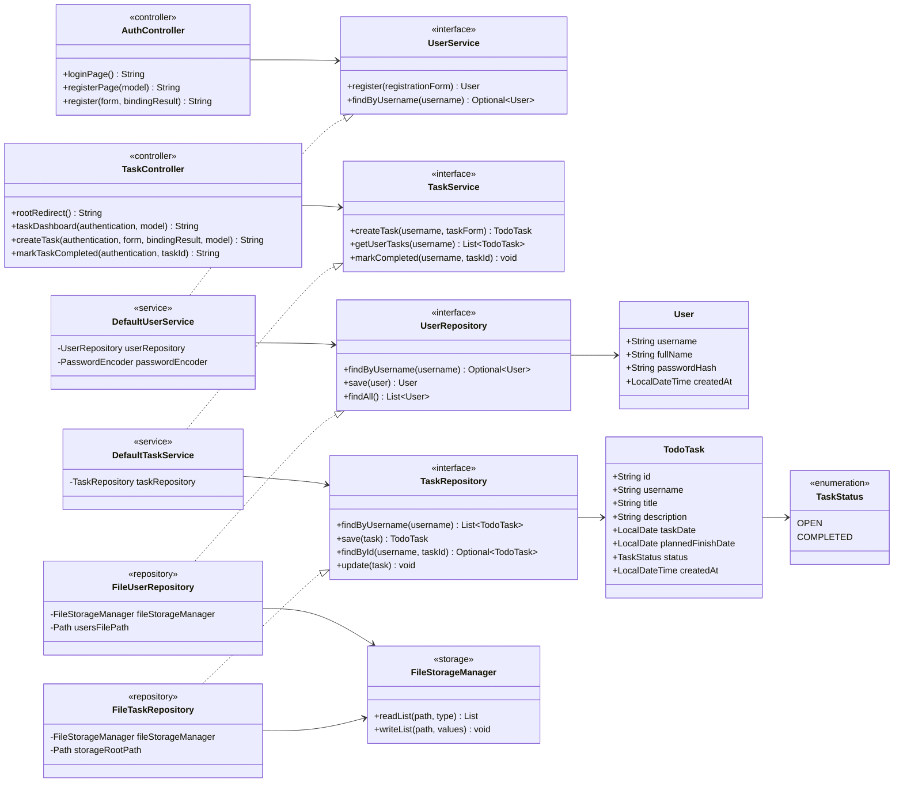
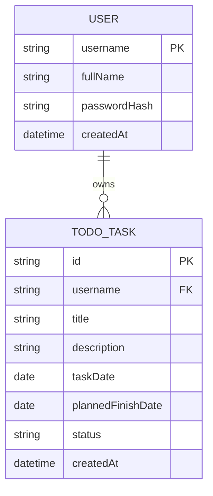
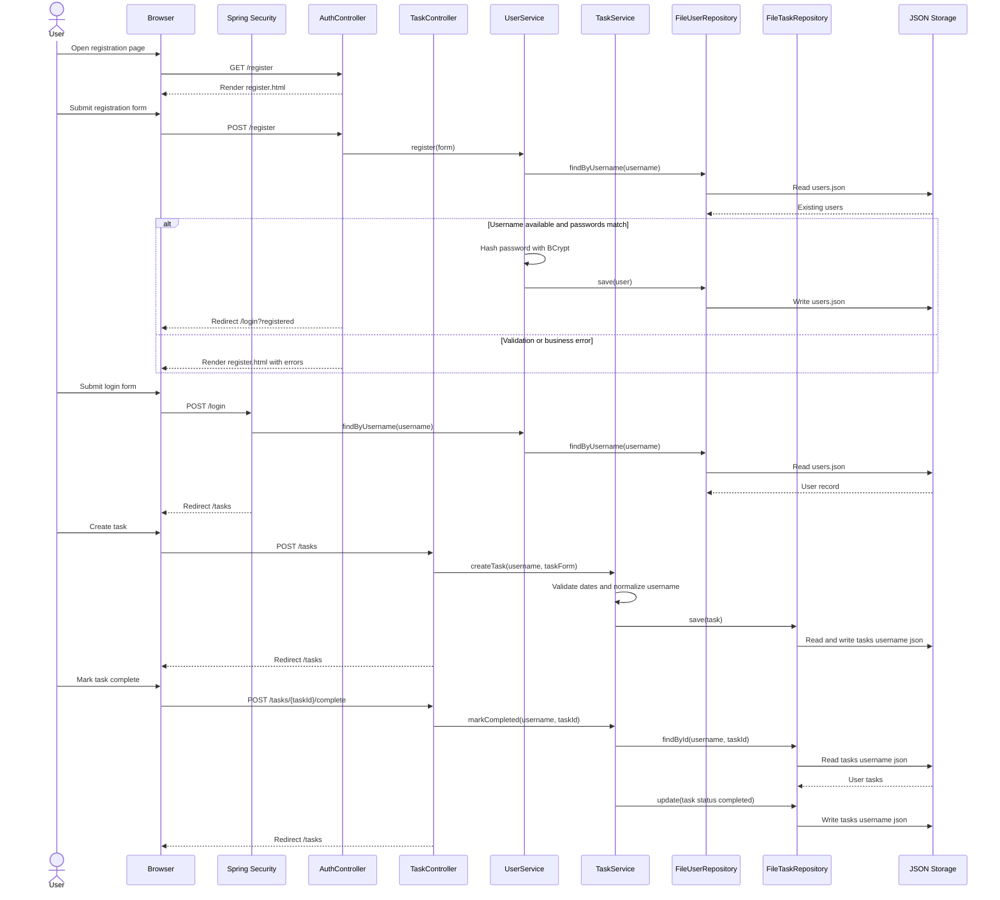
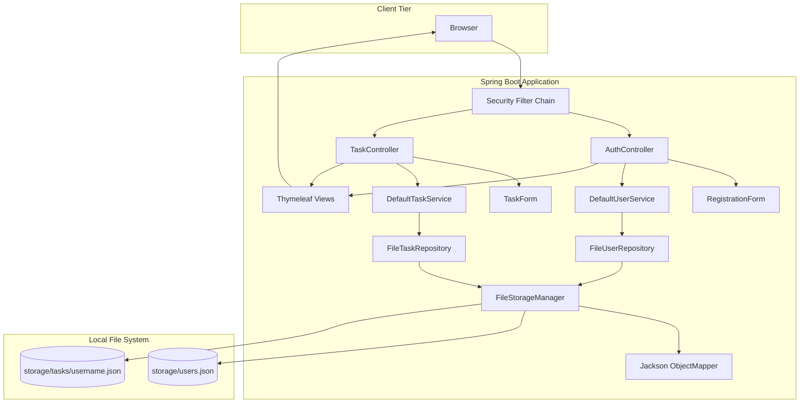
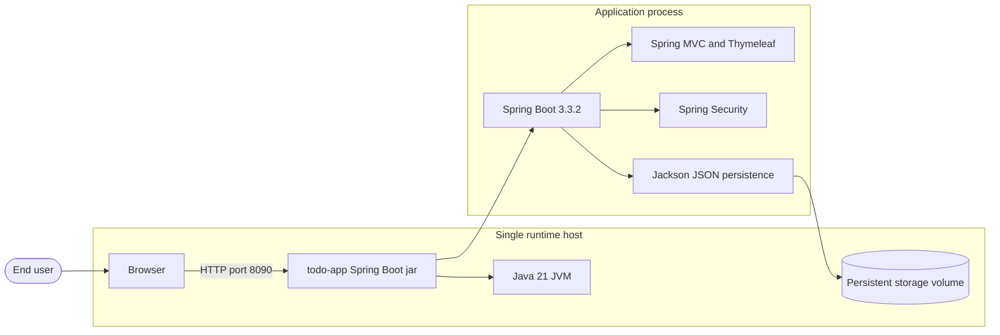
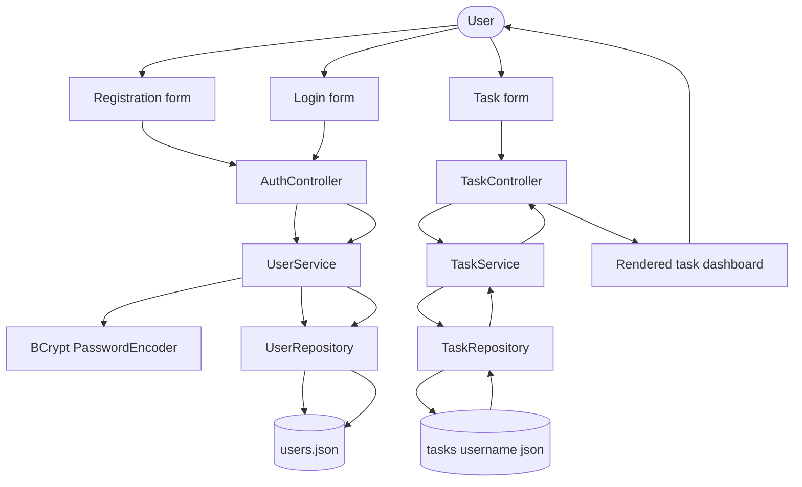
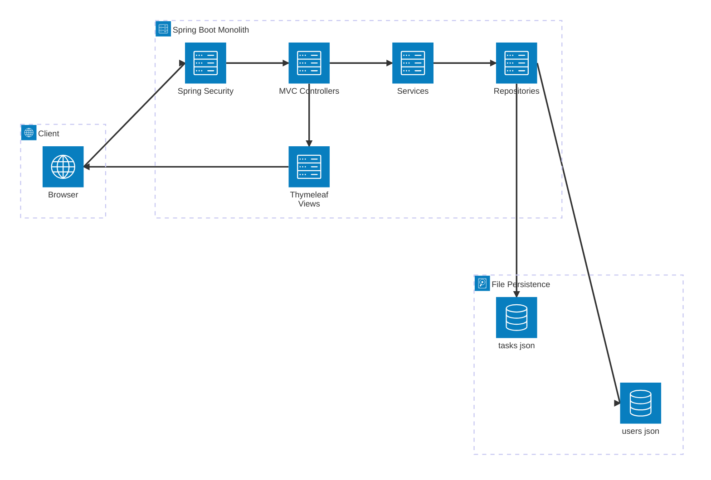
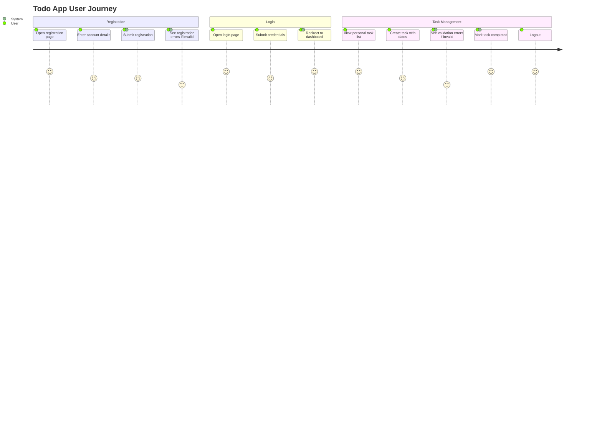
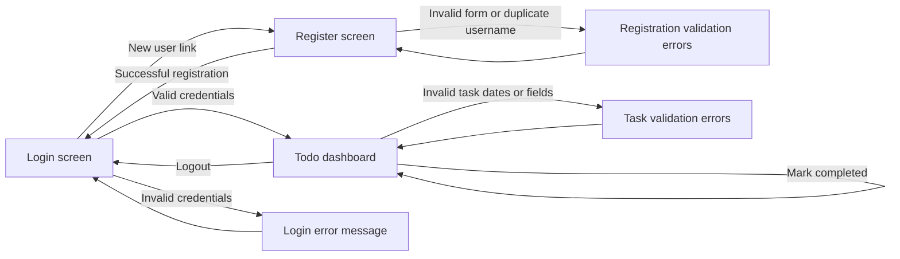

# sample_todo_app Solution Diagrams

## Design Scope

This document captures the design phase architecture for the Java Spring Boot Todo application. Diagrams are authored in Mermaid as the canonical representation.

## High Level Design

### System Context and Architecture

### High Level Responsibilities

| Layer | Responsibilities | Main Classes or Assets |
|---|---|---|
| Client | Uses server-rendered pages and submits forms. | Browser |
| Security | Authenticates users, hashes passwords, protects routes. | `SecurityConfig`, Spring Security, BCrypt |
| Web | Handles MVC routing, model population, redirects, validation errors. | `AuthController`, `TaskController` |
| DTO | Defines input validation boundaries. | `RegistrationForm`, `TaskForm` |
| Service | Enforces business rules and task/user workflows. | `DefaultUserService`, `DefaultTaskService` |
| Repository | Abstracts persistence. | `UserRepository`, `TaskRepository` |
| Persistence | Stores JSON files under configured root path. | `FileUserRepository`, `FileTaskRepository`, `FileStorageManager` |
| UI | Renders login, registration, and task dashboard. | Thymeleaf templates and CSS |

### Security, Observability, Scalability, and Maintainability

- Security: Spring Security session/form login, BCrypt password hashing, authenticated access to `/tasks`, user-scoped repository lookup.
- Observability: current design has no explicit observability; target production posture should add Spring Boot Actuator, structured logs, metrics, dashboards, and alerting.
- Scalability: current file storage is best for single-node deployment. Repository interfaces allow future migration to database-backed repositories.
- Maintainability: layered architecture, constructor injection, DTO validation, service-level business rules, and interface-driven repository/service boundaries.

## Low Level Design

### Detailed Component Design

### APIs and Routes

| Route | Method | Auth | Controller | Request Model | Response |
|---|---:|---|---|---|---|
| `/` | GET | Required | `TaskController` | None | Redirect to `/tasks` |
| `/login` | GET | Public | `AuthController` | None | `login.html` |
| `/register` | GET | Public | `AuthController` | None | `register.html` |
| `/register` | POST | Public | `AuthController` | `RegistrationForm` | Redirect to login or register view with errors |
| `/tasks` | GET | Required | `TaskController` | Auth principal | `tasks.html` |
| `/tasks` | POST | Required | `TaskController` | `TaskForm` | Redirect to `/tasks` or task view with errors |
| `/tasks/{taskId}/complete` | POST | Required | `TaskController` | Path variable | Redirect to `/tasks` |

### Data Schema

### Sequence Diagram

### Error Handling and Edge Cases

| Scenario | Handling |
|---|---|
| Registration DTO validation fails | Controller returns `register` view with field errors. |
| Password confirmation mismatch | `DefaultUserService` throws `IllegalArgumentException`; controller rejects registration. |
| Username already taken | `DefaultUserService` throws `IllegalArgumentException`; controller rejects registration. |
| Invalid login credentials | Spring Security redirects with login error. |
| Task DTO validation fails | Controller returns `tasks` view with existing task list and field errors. |
| Planned finish date before task date | `DefaultTaskService` throws `IllegalArgumentException`; controller rejects task creation. |
| Task ID not found for authenticated user | Service throws `IllegalArgumentException`. Current controller does not explicitly catch this path for completion. |
| Empty storage file or missing file | Repository delegates to storage manager; expected behavior is empty list when no records exist. |
| Cross-user task access attempt | Task lookup is scoped by authenticated username and per-user JSON file path. |

### Configuration

| Property | Default | Purpose |
|---|---|---|
| `server.port` | `8090` | Local HTTP port. |
| `spring.application.name` | `todo-app` | Spring application name. |
| `spring.thymeleaf.cache` | `false` | Template cache disabled for local development. |
| `app.storage.root-path` | `storage` | Root folder for JSON persistence. |

### Rollout and Operations

1. Build with `mvn clean package`.
2. Run tests with `mvn test`.
3. Deploy as a single Spring Boot application instance while file persistence remains in use.
4. Ensure persistent storage volume is mounted to `app.storage.root-path`.
5. Backup `users.json` and `tasks/*.json` before upgrades.
6. Add readiness and liveness checks before production deployment.
7. For horizontal scaling, introduce database-backed repository implementations and migrate data from JSON files.

## Component Diagram

## Deployment Diagram

## Data Flow Diagram

## Architecture Diagram

## Wireframes and User Flows

### User Journey

### Screen Flow

## Alternatives Considered

| Alternative | Pros | Cons | Recommendation |
|---|---|---|---|
| Continue file-based persistence | Simple, no database dependency, aligned with current code. | Limited concurrency and horizontal scaling, backup complexity. | Keep for sample/local single-instance scope. |
| Add relational database repository implementation | Scalable, transactional, easier reporting and backup. | Adds infrastructure and migration complexity. | Use when production multi-user or multi-instance requirements emerge. |
| Convert UI to SPA plus REST API | Rich client interactivity and API reuse. | Larger scope, client build pipeline, duplicated validation risk. | Not recommended unless explicitly required. |
| Containerize and deploy behind reverse proxy | Repeatable deployment, portable runtime. | Requires Dockerfile, volume strategy, image scanning. | Recommended as next operational hardening step. |
