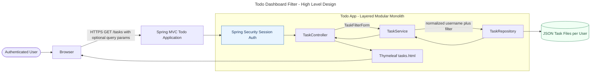
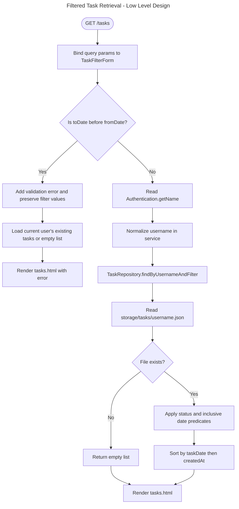
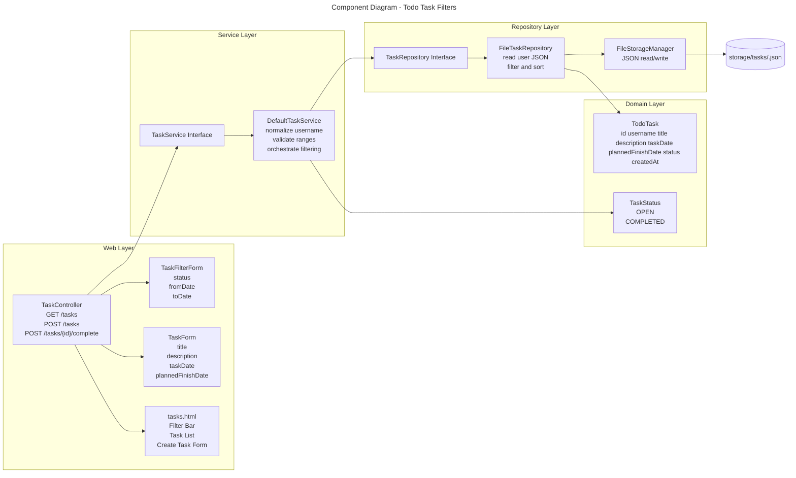
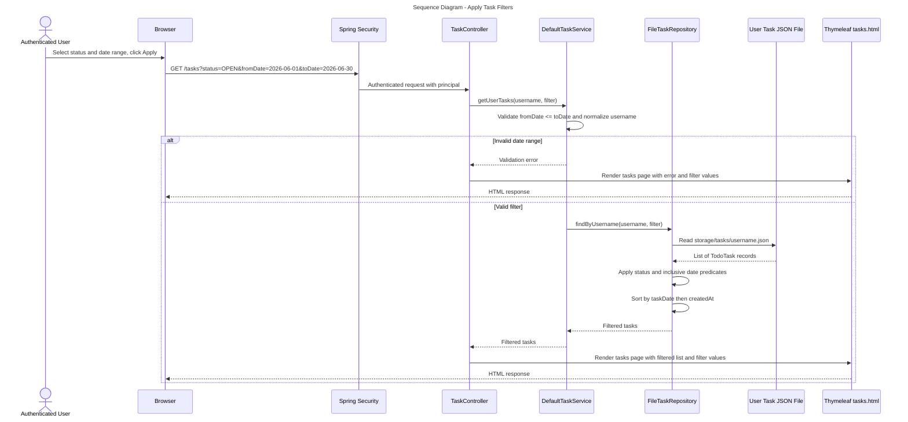
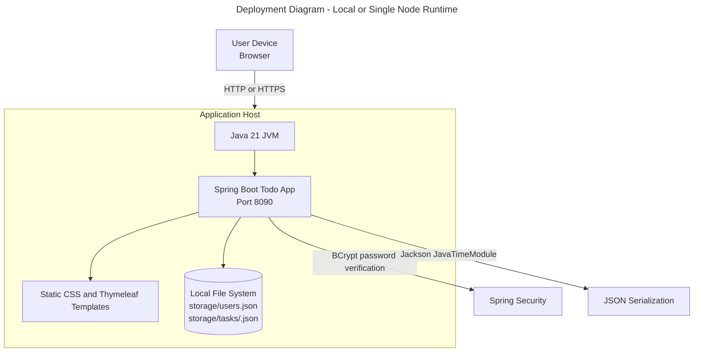
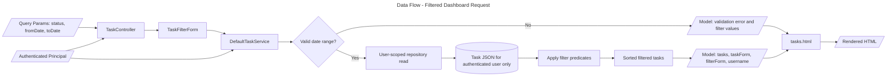
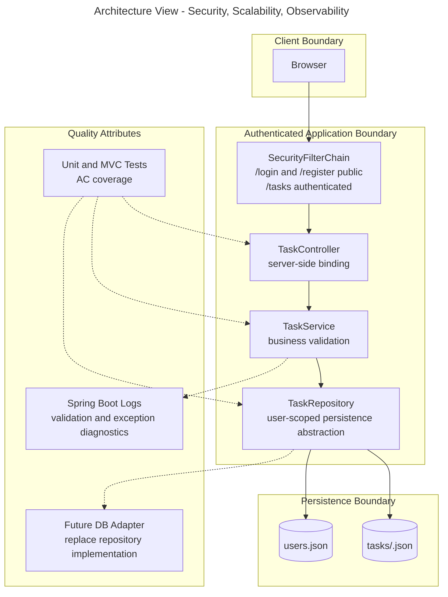
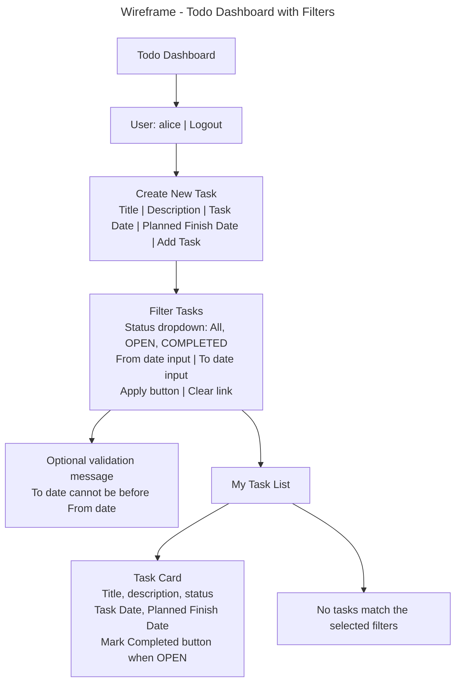

# Solution Diagrams - EPMCDMETST-55863

## High Level Design

## Low Level Design

## Component Diagram

## Sequence Diagram

## Deployment Diagram

## Data Flow Diagram

## Architecture Diagram

## Wireframe - Todo Dashboard Filter Bar

## API and Contract Notes

| Endpoint | Method | Query or Form Fields | Response |
|---|---|---|---|
| `/tasks` | GET | Optional `status`, `fromDate`, `toDate` | `tasks.html` with filtered authenticated-user task list |
| `/tasks` | POST | Existing `TaskForm` fields | Redirect to `/tasks` on success or render validation errors |
| `/tasks/{taskId}/complete` | POST | Path variable `taskId` | Redirect to `/tasks` after status update |

## Configuration and Rollout Notes

- No new runtime configuration is required.
- Existing `app.storage.root-path` remains the persistence root.
- Roll out as a backward-compatible enhancement because task JSON schema is unchanged.
- If a future database adapter is introduced, keep the service contract stable and move predicates into indexed queries.
