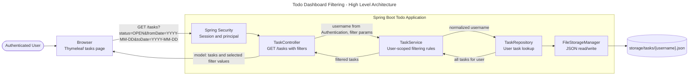
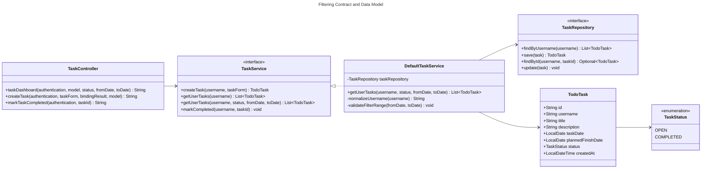
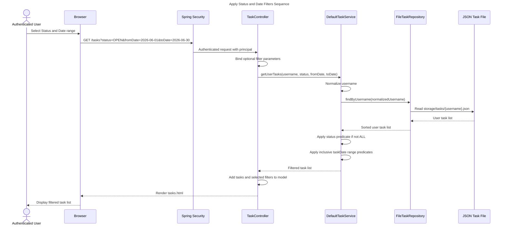
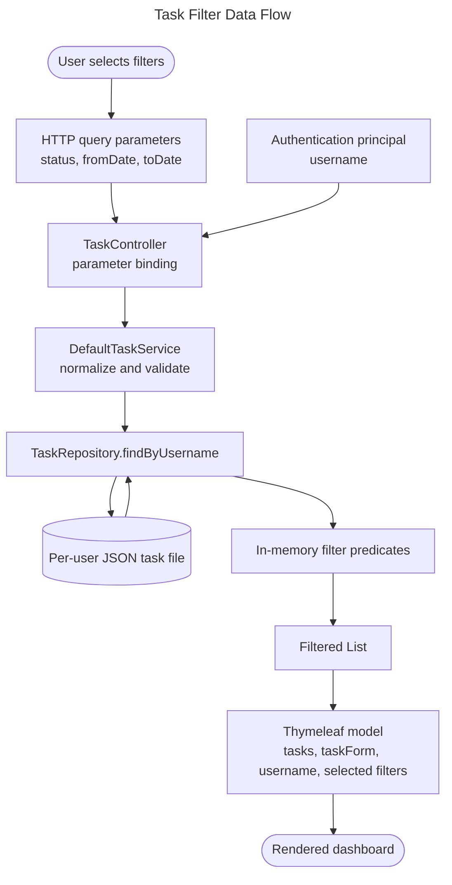
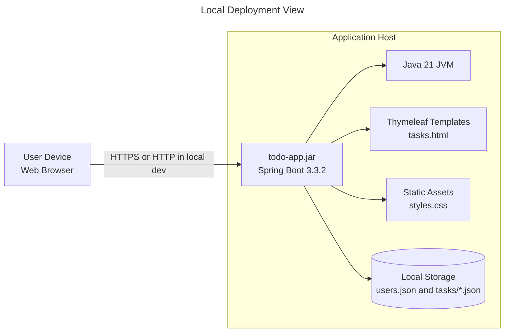
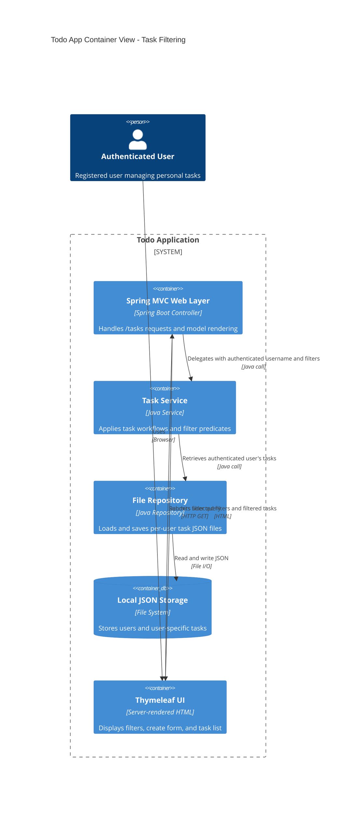
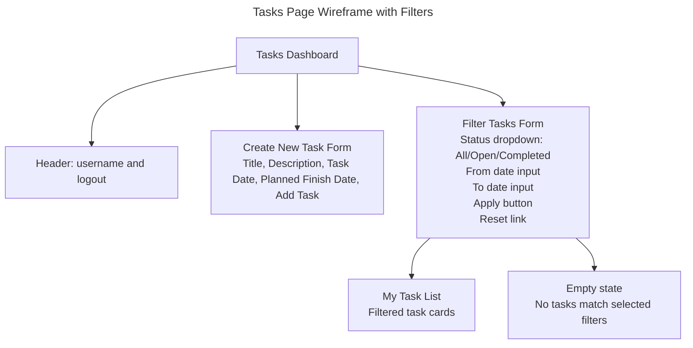
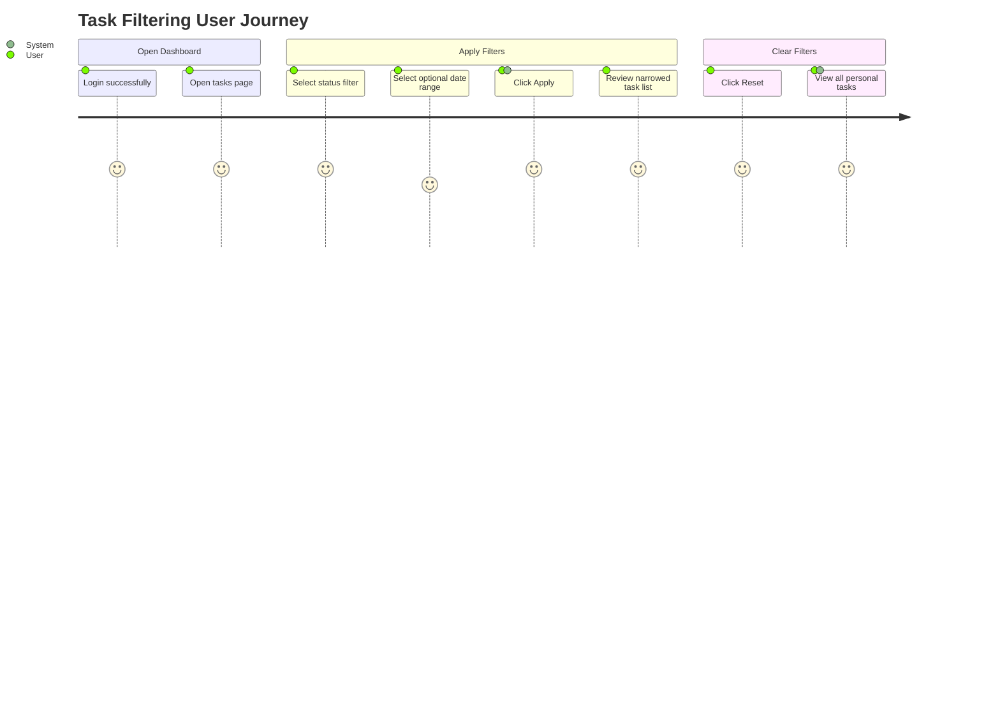

# Solution Diagrams — EPMCDMETST-55979

## High Level Design

### Architecture Approach

The task filtering feature is implemented as an incremental enhancement to the existing Spring Boot layered MVC architecture. The UI submits filter criteria as query parameters to `GET /tasks`; `TaskController` binds optional values, `TaskService` retrieves only the authenticated user's tasks, and filtering is performed in memory over the user-scoped task list returned by the file repository.

### Technology Choices

| Concern | Choice | Rationale |
|---|---|---|
| UI | Thymeleaf server-rendered filter form | Preserves existing architecture and progressive enhancement. |
| Backend | Spring MVC controller + service method overload | Keeps web binding separate from business filtering rules. |
| Persistence | Existing JSON file repository | Jira asks for in-memory filtering over user task list; no DB dependency needed. |
| Security | Spring Security authenticated principal | Prevents accepting user identity from request parameters. |
| Observability | Application logs around invalid filters and request handling if added later | Lightweight for sample application. |
| Scalability | Suitable for per-user local task files; can later move predicate to repository/database | Maintains extension path without premature migration. |

### High Level Architecture Diagram



### Alternatives Considered

| Alternative | Pros | Cons | Decision |
|---|---|---|---|
| Filter in controller | Minimal service contract change | Leaks business rules into web layer and weakens testability | Rejected |
| Add repository filtering method | Encapsulates query closer to persistence | Current persistence is file list; couples repository to UI filters prematurely | Deferred |
| Add `TaskFilterCriteria` DTO | Clean extensibility for more filters | Adds an extra type for a small feature | Recommended if more filters are expected |
| Use query parameter method overload | Simple, targeted change | Signature can grow if filters expand | Acceptable for this story |

## Low Level Design

### Component Diagram

```mermaid
---
title: Task Filtering Component Design
config:
  theme: default
---
flowchart TB
  subgraph Web["web package"]
    TaskController["TaskController\n- binds optional request params\n- populates model\n- returns tasks view"]
  end

  subgraph DTO["dto package"]
    TaskForm["TaskForm\nCreate task validation"]
    FilterParams["Filter Inputs\nstatus, fromDate, toDate"]
  end

  subgraph Service["service package"]
    TaskService["TaskService interface\ngetUserTasks with optional filters"]
    DefaultTaskService["DefaultTaskService\n- normalize username\n- retrieve user tasks\n- apply predicates\n- validate date range"]
  end

  subgraph Domain["domain package"]
    TodoTask["TodoTask\nid, username, title, taskDate, status"]
    TaskStatus["TaskStatus\nOPEN, COMPLETED"]
  end

  subgraph Repository["repository package"]
    TaskRepository["TaskRepository\nfindByUsername"]
    FileTaskRepository["FileTaskRepository\nread per-user JSON file"]
  end

  FileStore[("JSON File Store\nstorage/tasks/{username}.json")]

  TaskController --> TaskForm
  TaskController --> FilterParams
  TaskController --> TaskService
  TaskService <|-.-> DefaultTaskService
  DefaultTaskService --> TaskRepository
  TaskRepository <|-.-> FileTaskRepository
  FileTaskRepository --> FileStore
  DefaultTaskService --> TodoTask
  DefaultTaskService --> TaskStatus
```

### API and Contract Design



### Sequence Diagram



### Data Flow Diagram



### Deployment Diagram



### Architecture Diagram



## Wireframes and User Flow

### Filter Dashboard Wireframe



### User Journey



## Error Handling and Edge Cases

| Case | Expected Handling |
|---|---|
| No filters supplied | Return all authenticated user's tasks. |
| Status is `ALL` or blank | Do not apply status predicate. |
| Status is `OPEN` | Return only open tasks. |
| Status is `COMPLETED` | Return only completed tasks. |
| Only `fromDate` supplied | Return tasks with `taskDate >= fromDate`. |
| Only `toDate` supplied | Return tasks with `taskDate <= toDate`. |
| Both dates supplied | Return tasks with `fromDate <= taskDate <= toDate`. |
| `fromDate > toDate` | Recommended: reject with model error and preserve inputs. |
| Authenticated user has no tasks | Render normal empty state. |
| Filters match no tasks | Render empty filtered state. |
| User attempts cross-user filtering | Not possible through API because username is derived from authentication only. |

## Rollout Plan

1. Add service filtering contract and implementation.
2. Update controller binding and model population.
3. Update `tasks.html` with GET filter form and Reset link.
4. Add/extend unit tests for service and controller combinations.
5. Run `mvn test`.
6. Deploy as a regular application update; no data migration required.

## Mermaid Validation Notes

All diagrams are authored as Mermaid source blocks. No rendering tool was available in this execution environment, so diagrams are published as Mermaid source only.
