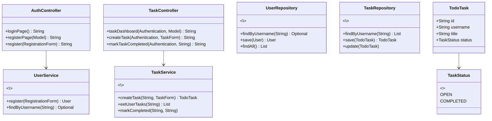

# High Level and Low Level Architecture Diagrams --- Sample Todo App

# High Level Architecture Diagram

```mermaid
graph LR
    subgraph Client["Client Tier"]
        Browser[Web Browser]
    end
    subgraph Application["Application Tier Spring Boot 3.3.x Java 21"]
        direction TB
        WebLayer["Web Layer AuthController TaskController"]
        SecurityLayer["Security Layer Spring Security BCÒypt Auth"]
        ServiceLayer["Service Layer UserService TaskService"]
        RepositoryLayer["Repository Layer UserRepository TaskRepository"]
        StorageLayer["Storage Layer FileStorageManager Jackson JSON"]
    end
    subgraph Persistence["Persistence Tier"]
        FS["Local File System storage/users.json storage/tasks/*.json"]
    end
    Browser <-->|HTTP PORT 8090| SecurityLayer
    SecurityLayer --> WebLayer
    WebLayer --> ServiceLayer
    ServiceLayer --> RepositoryLayer
    RepositoryLayer --> StorageLayer
    StorageLayer <-->|"Read Write JSON"| FS
```

# Low Level Architecture Diagram

```mermaid
classDiagram
    direction TB
    class AuthController {
        +loginPage() String
        +registerPage(Model) String
        +register(RegistrationForm) String
    }
    class TaskController {
        +taskDashboard(Authentication, Model) String
        +createTask(Authentication, TaskForm) String
        +markTaskCompleted(Authentication, String) String
    }
    class UserService {
        <\<interface>\>
        +register(RegistrationForm) User
        +findByUsername(String) Optional
    }
    class TaskService {
        <\<interface>\>
        +createTask(String, TaskForm) TodoTask
        +eetUserTasks(String) List
        +markCompleted(String, String)
    }
    class UserRepository {
        <\<interface>\>
        +findByUsername(String) Optional
        +save(User) User
        +findAll() List
    }
    class TaskRepository {
        <\<interface>\>
        +findByUsername(String) List
        +save(TodoTask) TodoTask
        +update(TodoTask)
    }
    class TodoTask {
        +String id
        +String username
        +String title
        +TaskStatus status
    }
    class TaskStatus {
        <\<enumeration\>>
        OPEN
        COMPLETED
    }
    AuthController --> UserService
    TaskController --> TaskService
    TodoTask --> TaskStatus
```
