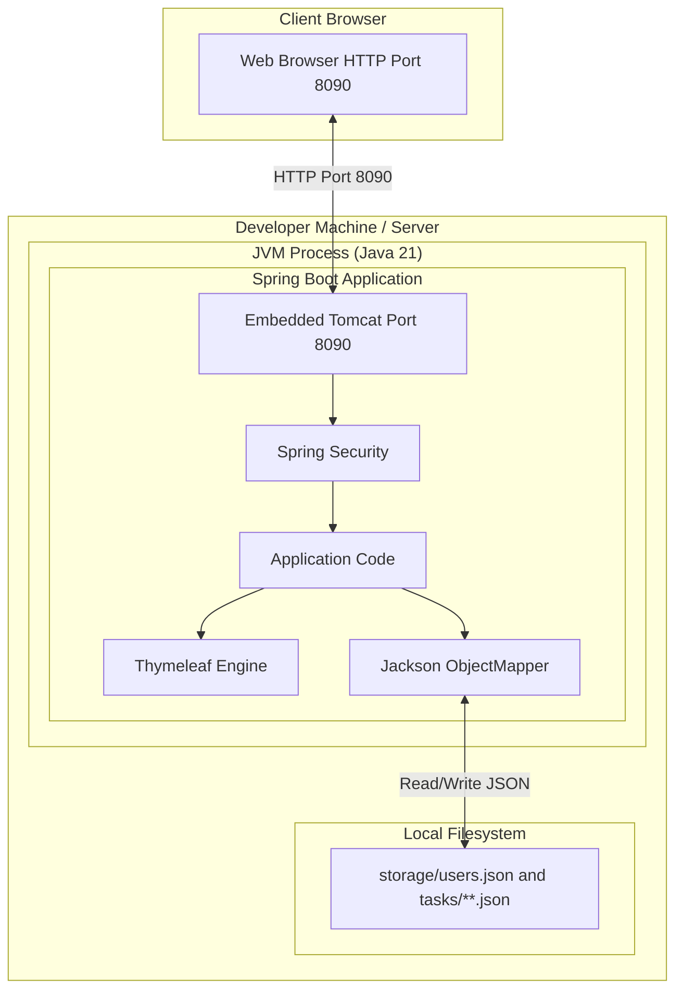

# Deployment Diagram --- Sample Todo App

```mermaid
graph TB
    subgraph DevMachine["Developer Machine / Server"]
        subgraph JVM["JVM Process (Java 21)"]
            subgraph SpringApp["Spring Boot Application"]
                TomcatEmb[Embedded Tomcat Port 8090]
                AppCode[Application Code]
                ThymeleafEng[Thymeleaf Engine]
                SpringSec[Spring Security]
                Jackson[Jackson ObjectMapper]
            end
        end
        subgraph FileSystem["Local Filesystem"]
            StorageDir["storage/users.json and tasks/**.json"]
        end
    end
    subgraph ClientBrowser["Client Browser"]
        Browser[Web Browser HTTP Port 8090]
    end
    Browser <-->|HTTP Port 8090| TomcatEmb
    TomcatEmb --> SpringSec
    SpringSec --> AppCode
    AppCode --> ThymeleafEng
    AppCode --> Jackson
    Jackson <-->|Read/Write JSON| StorageDir
```
