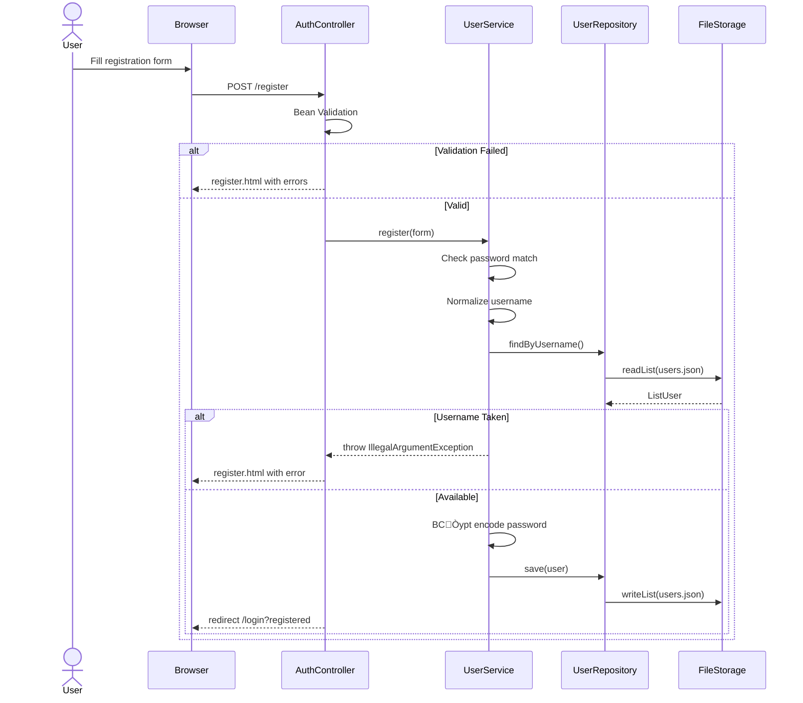
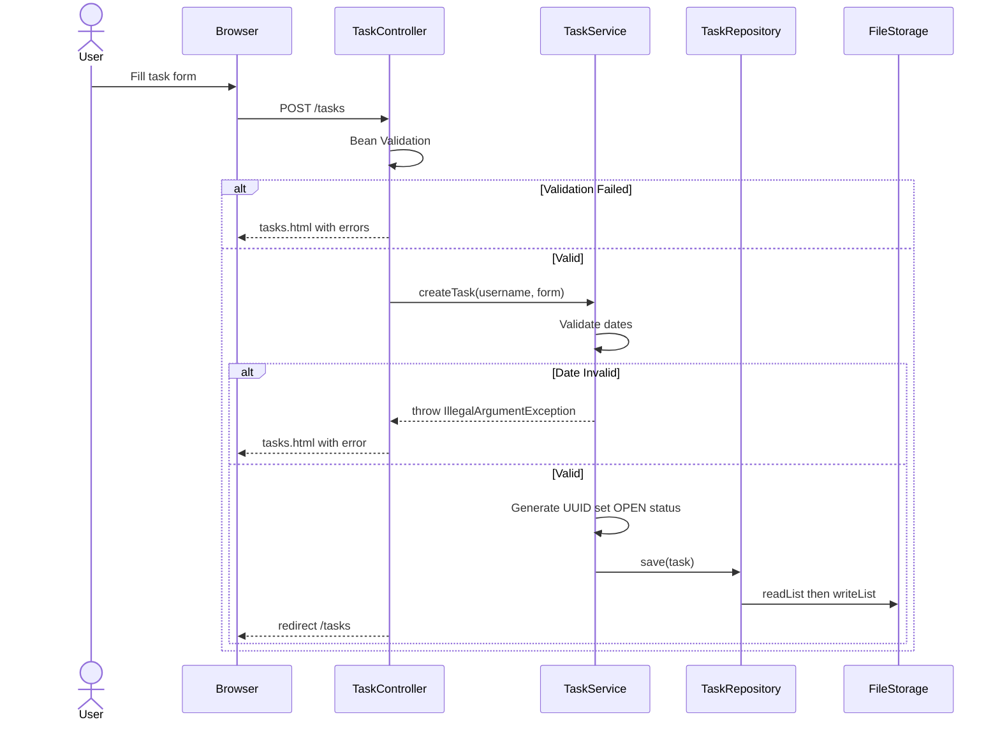

# Sequence Diagrams --- Sample Todo App

## User Registration Flow

```mermaid
sequenceDiagram
    actor User
    participant Browser
    participant AuthController
    participant UserService
    participant UserRepository
    participant FileStorage

    User->>Browser: Fill registration form
    Browser->>AuthController: POST /register
    AuthController->>AuthController: Bean Validation
    alt Validation Failed
        AuthController-->>Browser: register.html with errors
    else Valid
        AuthController->>UserService: register(form)
        UserService->>UserService: Check password match
        UserService->>UserService: Normalize username
        UserService->>UserRepository: findByUsername()
        UserRepository->>FileStorage: readList(users.json)
        FileStorage-->>UserRepository: ListUser
        alt Username Taken
            UserService-->>AuthController: throw IllegalArgumentException
            AuthController-->>Browser: register.html with error
        else Available
            UserService->>UserService: BCÒypt encode password
            UserService->>UserRepository: save(user)
            UserRepository->>FileStorage: writeList(users.json)
            AuthController-->>Browser: redirect /login?registered
        end
    end
```

## Create Task Flow

```mermaid
sequenceDiagram
    actor User
    participant Browser
    participant TaskController
    participant TaskService
    participant TaskRepository
    participant FileStorage

    User->>Browser: Fill task form
    Browser->>TaskController: POST /tasks
    TaskController->>TaskController: Bean Validation
    alt Validation Failed
        TaskController-->>Browser: tasks.html with errors
    else Valid
        TaskController->>TaskService: createTask(username, form)
        TaskService->>TaskService: Validate dates
        alt Date Invalid
            TaskService-->>TaskController: throw IllegalArgumentException
            TaskController-->>Browser: tasks.html with error
        else Valid
            TaskService->>TaskService: Generate UUID set OPEN status
            TaskService->>TaskRepository: save(task)
            TaskRepository->>FileStorage: readList then writeList
            TaskController-->>Browser: redirect /tasks
        end
    end
```
