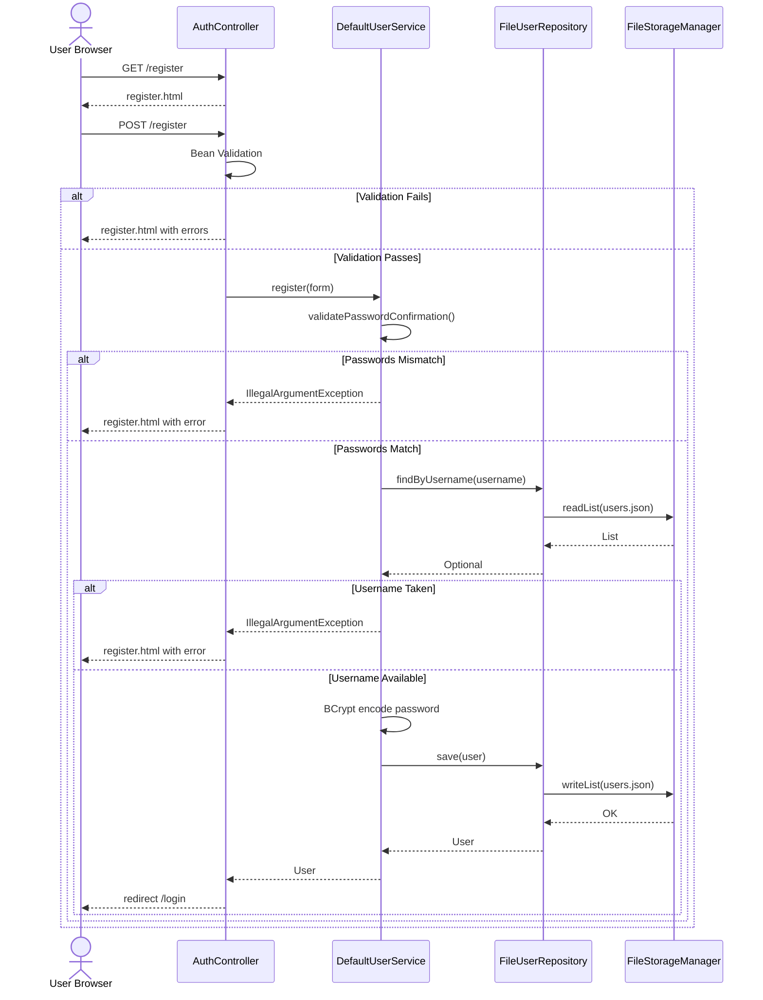
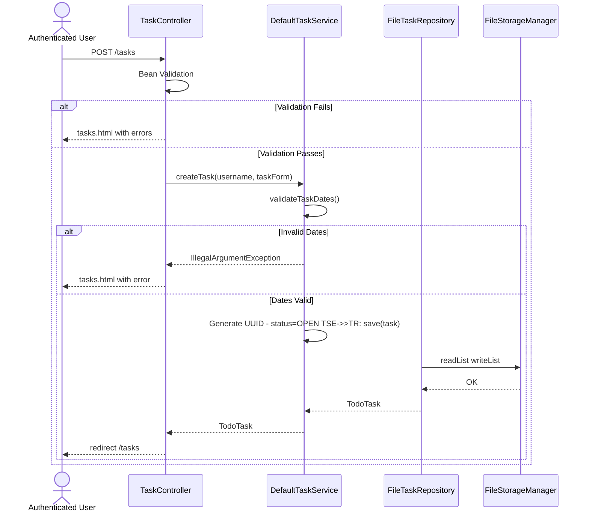
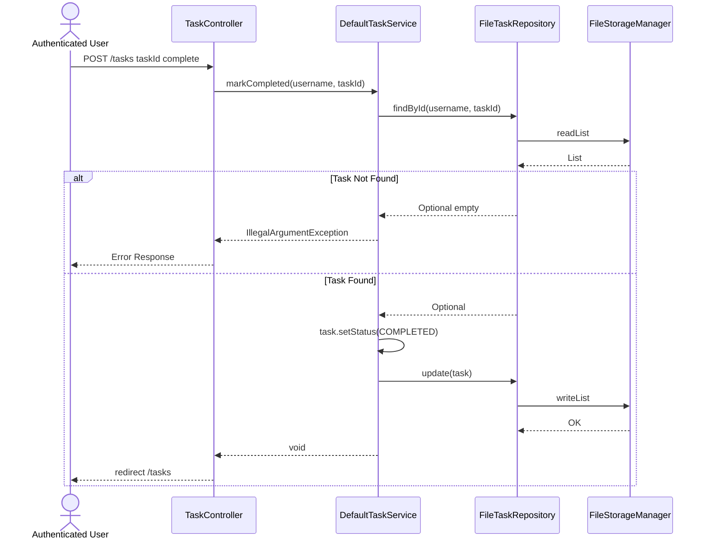

# Sequence Diagrams - Sample Todo App

## 1. User Registration Flow

```mermaid
sequenceDiagram
    actor User as User Browser
    participant AC as AuthController
    participant US as DefaultUserService
    participant UR as FileUserRepository
    participant FS as FileStorageManager

    User->>AC: GET /register
    AC-->>User: register.html
    User->>AC: POST /register
    AC->>AC: Bean Validation
    alt Validation Fails
        AC-->>User: register.html with errors
    else Validation Passes
        AC->>US: register(form)
        US->>US: validatePasswordConfirmation()
        alt Passwords Mismatch
            US-->>AC: IllegalArgumentException
            AC-->>User: register.html with error
        else Passwords Match
            US->>UR: findByUsername(username)
            UR->>FS: readList(users.json)
            FS-->>UR: List
            UR-->>US: Optional
            alt Username Taken
                US-->>AC: IllegalArgumentException
                AC-->>User: register.html with error
            else Username Available
                US->>US: BCrypt encode password
                US->>UR: save(user)
                UR->>FS: writeList(users.json)
                FS-->>UR: OK
                UR-->>US: User
                US-->>AC: User
                AC-->>User: redirect /login
            end
        end
    end
```

## 2. Task Creation Flow

```mermaid
sequenceDiagram
    actor User as Authenticated User
    participant TC as TaskController
    participant TS as DefaultTaskService
    participant TR as FileTaskRepository
    participant FS as FileStorageManager

    User->>TC: POST /tasks
    TC->>TC: Bean Validation
    alt Validation Fails
        TC-->>User: tasks.html with errors
    else Validation Passes
        TC->>TS: createTask(username, taskForm)
        TS->>TS: validateTaskDates()
        alt Invalid Dates
            TS-->>TC: IllegalArgumentException
            TC-->>User: tasks.html with error
        else Dates Valid
            TS->>TS: Generate UUID - status=OPEN	 TSE->>TR: save(task)
            TR->>FS: readList writeList
            FS-->>TR: OK
            TR-->>TS: TodoTask
            TS-->>TC: TodoTask
            TC-->>User: redirect /tasks
        end
    end
```

## 3. Mark Task Complete Flow

```mermaid
sequenceDiagram
    actor User as Authenticated User
    participant TC as TaskController
    participant TS as DefaultTaskService
    participant TR as FileTaskRepository
    participant FS as FileStorageManager

    User->>TC: POST /tasks taskId complete
    TC->>TS: markCompleted(username, taskId)
    TS->>TR: findById(username, taskId)
    TR->>FS: readList
    FS-->>TR: List
    alt Task Not Found
        TR-->>TS: Optional empty
        TS-->>TC: IllegalArgumentException
        TC-->>User: Error Response
    else Task Found
        TR-->>TS: Optional
        TS->>TS: task.setStatus(COMPLETED)
        TS->>TR: update(task)
        TR->>FS: writeList
        FS-->>TR: OK
        TS-->>TC: void
        TC-->>User: redirect /tasks
    end
```
